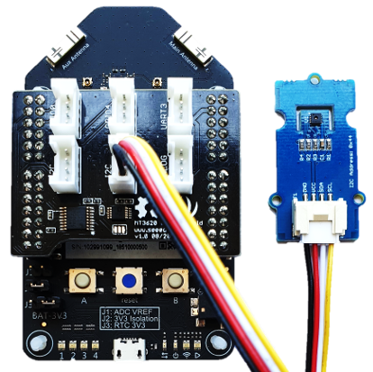

# Azure Sphere Part 1 - Getting Started with Azure Sphere and the Grove Shield Sensor Kit



Follow me on Twitter [@dglover](https://twitter.com/dglover)

|Author|[Dave Glover](https://developer.microsoft.com/en-us/advocates/dave-glover?WT.mc_id=github-blog-dglover), Microsoft Cloud Developer Advocate |
|:----|:---|
|Target Platform | Seeed Studio Azure Sphere MT3620 |
|Developer Platform | Windows 10 or Ubuntu 18.04 |
|Azure SDK | Azure Sphere SDK 19.11 or better |
|Developer Tools| [Visual Studio (The free Community Edition or better)](https://visualstudio.microsoft.com/vs/?WT.mc_id=github-blog-dglover) or [Visual Studio Code (Free OSS)](https://code.visualstudio.com?WT.mc_id=github-blog-dglover)|
|Hardware | [Seeed Studio Grove Shield](https://www.seeedstudio.com/MT3620-Grove-Shield.html), and the [Grove Temperature and Humidity Sensor (SHT31)](https://www.seeedstudio.com/Grove-Temperature-Humidity-Sensor-SHT31.html) |
|Source Code | https://github.com/gloveboxes/Create-a-Secure-Azure-Sphere-App-using-the-Grove-Shield-Sensor-Kit|
|Language| C|
|Date| January 2020 |

---

## Azure Sphere Learning Path

Each module assumes you have completed the previous module.

* Lab 0: [Introduction Azure Sphere and Lab Set Up](https://github.com/gloveboxes/Azure-Sphere-Learning-Path/tree/master/Lab%200%20-%20Introduction%20and%20Lab%20Set%20Up)
* Lab 1: [Build your first Azure Sphere Application with Visual Studio](https://github.com/gloveboxes/Azure-Sphere-Learning-Path/tree/master/Lab%201%20-%20Build%20your%20first%20Azure%20Sphere%20Application%20with%20Visual%20Studio)
* Lab 2: [Send Telemetry from an Azure Sphere to Azure IoT Central](https://github.com/gloveboxes/Azure-Sphere-Learning-Path/tree/master/Lab%202%20-%20Send%20Telemetry%20from%20an%20Azure%20Sphere%20to%20Azure%20IoT%20Central)
* Lab 3: [Control an Azure Sphere with Device Twins and Direct Methods](https://github.com/gloveboxes/Azure-Sphere-Learning-Path/tree/master/Lab%203%20-%20Control%20an%20Azure%20Sphere%20with%20Device%20Twins%20and%20Direct%20Methods)
* Lab 4: [Integrating FreeRTOS with Azure Sphere Inter-Core Communications](https://github.com/gloveboxes/Azure-Sphere-Learning-Path/tree/master/Lab%204%20-%20Integrating%20FreeRTOS%20with%20Azure%20Sphere%20Inter-Core%20Communications)
* Lab 5: [Automating Azure Sphere Registration with Azure IoT Central](https://github.com/gloveboxes/Azure-Sphere-Learning-Path/tree/master/Lab%205%20-%20Automating%20Azure%20Sphere%20Registration%20with%20Azure%20IoT%20Central)

---

## What is Azure Sphere

Azure Sphere is a solution for securing MCU Power Devices. It comprises a secured, connected, crossover microcontroller unit (MCU), a custom high-level Linux-based operating system (OS), and a cloud-based security service that provides continuous, renewable security.


Growing ecosystem of hardware partners.


---

## Why Azure Sphere

As billions of new devices are connected, organizations need to secure them to help protect data, privacy, physical safety, and infrastructure. Azure Sphere builds on decades of Microsoft experience in hardware, software, and cloud to provide a turnkey solution for IoT devices. Get defense in depth to embrace IoT innovation with confidence.

---

## Hardware Required

This tutorial requires the [Seeed Studio Azure Sphere](https://www.seeedstudio.com/Azure-Sphere-MT3620-Development-Kit-US-Version-p-3052.html), the [Seeed Studio Grove Shield](https://www.seeedstudio.com/MT3620-Grove-Shield.html), and the [Grove Temperature and Humidity Sensor (SHT31)](https://www.seeedstudio.com/Grove-Temperature-Humidity-Sensor-SHT31.html). These parts are available from many online stores including [Seeed Studio](www.seeedstudio.com).

Be sure to plug the Grove Temperature Sensor into one of the I2C connectors on the Grove Shield.

---

## Set up your Development Environment

This tutorial assumes Windows 10 and [Visual Studio (The free Community Edition or better)](https://visualstudio.microsoft.com/vs/?WT.mc_id=github-blog-dglover). For now, Azure Sphere templates are only available for Visual Studio. However, you can clone and open this solution on Windows and Ubuntu 18.04 with [Visual Studio Code](https://code.visualstudio.com/?WT.mc_id=github-blog-dglover). 

```bash
git clone https://github.com/gloveboxes/Create-a-Secure-Azure-Sphere-App-using-the-Grove-Shield-Sensor-Kit.git
```

Follow the Azure Sphere [Overview of set up procedures](https://docs.microsoft.com/en-au/azure-sphere/install/overview?WT.mc_id=github-blog-dglover) guide.

---

## Azure Sphere SDK

This tutorial assumes you are using the [Azure Sphere SDK 19.11](https://docs.microsoft.com/en-us/azure-sphere/resources/release-notes-1911?WT.mc_id=github-blog-dglover) or better which uses the CMake Build System.

This tutorial includes a forked version of the Seeed Studio [Grove Shield Library](https://github.com/Seeed-Studio/MT3620_Grove_Shield) that has been migrated to CMake for Azure Sphere SDK 19.11.

---

## Grove Shield Sensor Capabilities Quick Reference

| Sensors  | Socket | Capabilities |
| :------------- | :------------- | :----------- |
| Grove Light Sensor  | Analog | "Gpio": [ 57, 58 ], "Uart": [ "ISU0"] |
| Grove Rotary Sensor | Analog | "Gpio": [ 57, 58 ], "Uart": [ "ISU0"] |
| Grove 4 Digit Display | GPIO0 or GPIO4 | "Gpio": [ 0, 1 ] or "Gpio": [ 4, 5 ] |
| Grove LED Button | GPIO0 or GPIO4 |  "Gpio": [ 0, 1 ] or "Gpio": [ 4, 5 ] |
| Grove Oled Display 96x96 | I2C | "Uart": [ "ISU0"]  |
| Grove Temperature Humidity SHT31 | I2C | "Uart": [ "ISU0"] |
| Grove UART3 | UART3 | "Uart": [ "ISU3"] |
| LED 1 | Red <br/> Green <br/> Blue | "Gpio": [ 8 ] <br/> "Gpio": [ 9 ] <br/> "Gpio": [ 10 ] |
| LED 2 | Red <br/> Green <br/> Blue | "Gpio": [ 15 ] <br/> "Gpio": [ 16 ] <br/> "Gpio": [ 17 ] |
| LED 3 | Red <br/> Green <br/> Blue | "Gpio": [ 18 ] <br/> "Gpio": [ 19 ] <br/> "Gpio": [ 20 ] |
| LED 4 | Red <br/> Green <br/> Blue | "Gpio": [ 21 ] <br/> "Gpio": [ 22 ] <br/> "Gpio": [ 23 ] |

For more pin definitions see the __mt3620_rdb.h__ in the MT3620_Grove_Shield/MT3620_Grove_Shield_Library folder.

### Azure Sphere Grove Kit

| Azure Sphere   |  Image  |
| ---- | ---- |
| [Azure Sphere MT3620 Development Kit](https://www.seeedstudio.com/Azure-Sphere-MT3620-Development-Kit-US-Version-p-3052.html)|
| [Azure Sphere MT3620 Development Kit Shield](https://www.seeedstudio.com/Grove-Starter-Kit-for-Azure-Sphere-MT3620-Development-Kit.html). <br/> Note, you can also purchase the parts separately. |  |

### Azure Sphere MT3620 Developer Board Pinmap

The full Azure Sphere MT3620 Board Pinmap can be found on the [Azure Sphere MT3620 Development Kit](https://www.seeedstudio.com/Azure-Sphere-MT3620-Development-Kit-US-Version-p-3052.html) page.


