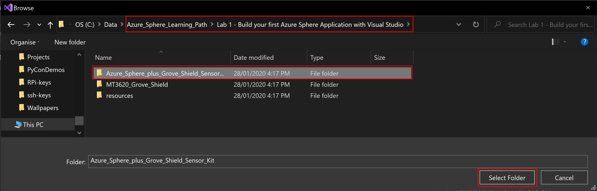
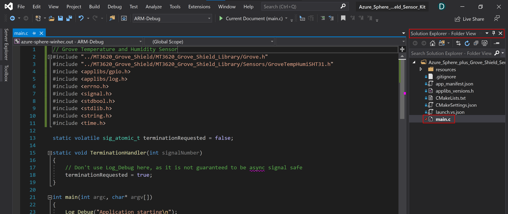
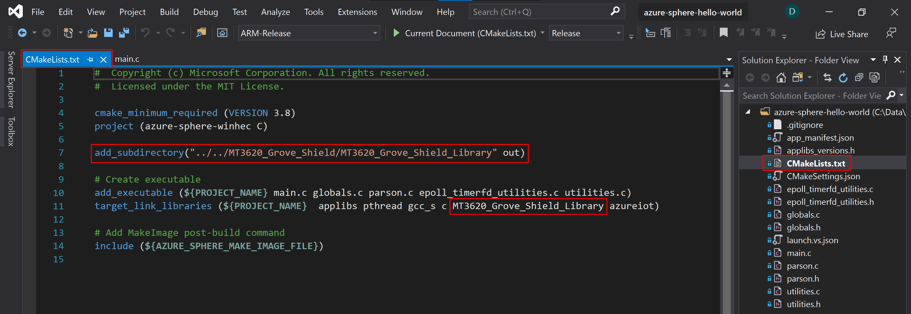
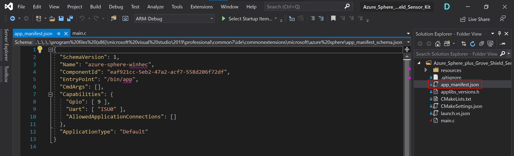
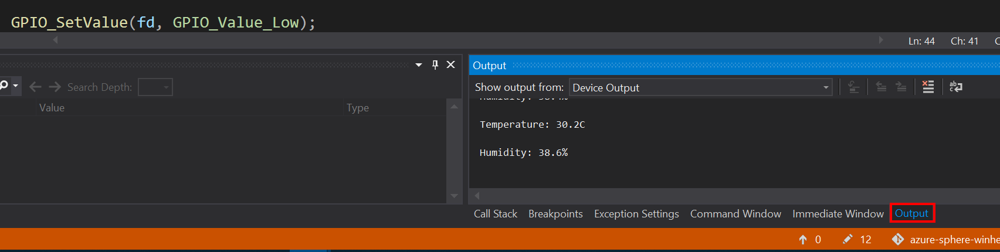
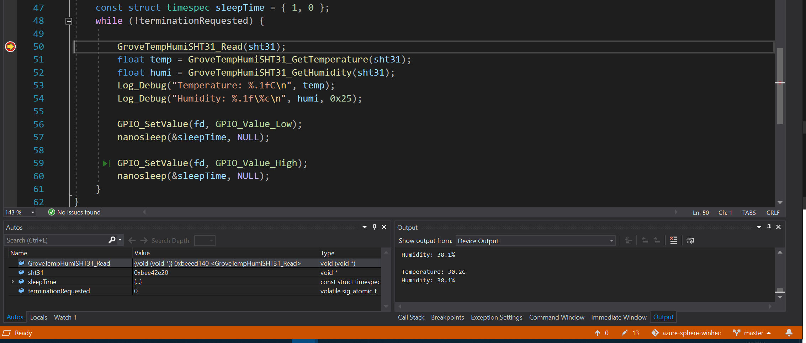
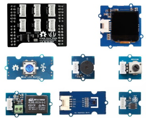

# Lab 1 - Build your first Azure Sphere Application with Visual Studio

<!--  -->

---

Follow me on Twitter [@dglover](https://twitter.com/dglover)

|Author|[Dave Glover](https://developer.microsoft.com/en-us/advocates/dave-glover?WT.mc_id=github-blog-dglover), Microsoft Cloud Developer Advocate |
|:----|:---|
|Hardware | [Seeed Studio Azure Sphere MT3620](https://www.seeedstudio.com/Azure-Sphere-MT3620-Development-Kit-US-Version-p-3052.html), [Seeed Studio Grove Shield](https://www.seeedstudio.com/MT3620-Grove-Shield.html), and the [Grove Temperature and Humidity Sensor (SHT31)](https://www.seeedstudio.com/Grove-Temperature-Humidity-Sensor-SHT31.html) |
|Source Code | https://github.com/gloveboxes/Azure-Sphere-Learning-Path.git |
|Language| C|
|Date| January  2020|

---

## Azure Sphere Learning Path

Each module assumes you have completed the previous module.

* Lab 0: [Introduction Azure Sphere and Lab Set Up](https://github.com/gloveboxes/Azure-Sphere-Learning-Path/tree/master/Lab%200%20-%20Introduction%20and%20Lab%20Set%20Up)
* Lab 1: [Build your first Azure Sphere Application with Visual Studio](https://github.com/gloveboxes/Azure-Sphere-Learing-Path/tree/master/Lab%201%20-%20Build%20your%20first%20Azure%20Sphere%20Application%20with%20Visual%20Studio)
* Lab 2: [Send Telemetry from an Azure Sphere to Azure IoT Central](https://github.com/gloveboxes/Azure-Sphere-Learing-Path/tree/master/Lab%202%20-%20Send%20Telemetry%20from%20an%20Azure%20Sphere%20to%20Azure%20IoT%20Central)
* Lab 3: [Control an Azure Sphere with Device Twins and Direct Methods](https://github.com/gloveboxes/Azure-Sphere-Learing-Path/tree/master/Lab%203%20-%20Control%20an%20Azure%20Sphere%20with%20Device%20Twins%20and%20Direct%20Methods)
* Lab 4: [Integrating FreeRTOS with Azure Sphere Inter-Core Communications](https://github.com/gloveboxes/Azure-Sphere-Learing-Path/tree/master/Lab%204%20-%20Azure%20Sphere%20Inter-Core%20Communications)
* Lab 5: [Automating Azure Sphere Registration with Azure IoT Central](https://github.com/gloveboxes/Azure-Sphere-Learing-Path/tree/master/Lab%205%20-%20Automating%20Azure%20Sphere%20Registration%20with%20Azure%20IoT%20Central)

---

## Open Lab 1 Project

### Step 1: Ensure you have cloned the lab source code

	```bash
	git clone https://github.com/gloveboxes/Azure-Sphere-Learning-Path.git
	```

### Step 2: Start Visual Studio, select **Open a local folder**


### Step 3: Open the lab project

1. Navigate to cloned **Azure Sphere Learning Path** folder
2. Open **Lab 1 - Build your first Azure Sphere folder**
3. Select folder  **Azure_Sphere_plus_Grove_Shield_Sensor_Kit**
4. Click **Select Folder** button.



### Step 4: Verify Project Opened Correctly

From the **Solution Explorer**, open the **main.c** file.



---
<!-- 
## Create a new Visual Studio Azure Sphere Project

Start Visual Studio and create a new project in the same directory you cloned this tutorial into which includes the MT3620 Grove Shield Library.

It is important to create the Visual Studio Project in the same folder you cloned the MT3620 Grove Shield as there are relative links to this library in the application you will create.

```text
azure-sphere
	|- MT3620_Grove_Shield
	|- YourAzureSphereApplication
```


### Select Azure Sphere Project Template

Type **sphere** in the search box and select the Azure Sphere Blink template.


### Configure new Azure Sphere Project

Name the project and set the save location.

 -->

### Open the CMakeLists.txt file

**CMakelists.txt** defines the build process, the code files,  library locations, and more.

Note the references to **MT3620_Grove_Shield_Library**.

1. **add subdirectory** is the location of the MT3620_Grove_Shield_Library source code.
2. **target_link_libraries** includes the MT3620_Grove_Shield_Library into the linking process.



---

## Understanding the High-Level Core Security

Applications on Azure Sphere are locked down by default and you must grant capabilities to the application. This is core to Azure Sphere security and is also known as the [Principle of least privilege](https://en.wikipedia.org/wiki/Principle_of_least_privilege).

High-Level Application capabilities include what hardware can be accessed, what internet services can be called (including Azure IoT Central and the Azure Device Provisioning Service), and what inter-core communications are allowed.


1. Review the [Grove Shield Sensor Capabilities Quick Reference](#grove-shield-sensor-capabilities-quick-reference) to understand what capabilities are required for each sensor in the library.
2. From Visual Studio open the **app_manifest.json** file.



Review the defined capabilities:

```json
"Capabilities": {
    "Gpio": [ 9 ],
    "Uart": [ "ISU0" ],
    "AllowedApplicationConnections": []
  },
```

1. **"Gpio": [ 9 ]**: GPIO 9 is used to control an onboard LED
2. **"Uart": [ "ISU0" ]**: Access to the I2C SHT31 temperature/humidity sensor via the Grove Shield was built before Azure Sphere supported I2C. Hence calls to the sensor are proxied via the Uart.

---

## Review the Code

The following code is found in the **main.c** file. 

1. The LED connected to GPIO 9 is opened, 
2. The Grove Shield UART port is opened, then the Grove SHT31 Sensor
3. The application then loops, reading the temperature and humidity and writing this information to the debugger logger.

```c
// Grove Temperature and Humidity Sensor
#include "../MT3620_Grove_Shield/MT3620_Grove_Shield_Library/Grove.h"
#include "../MT3620_Grove_Shield/MT3620_Grove_Shield_Library/Sensors/GroveTempHumiSHT31.h"
#include <applibs/gpio.h>
#include <applibs/log.h>
#include <errno.h>
#include <signal.h>
#include <stdbool.h>
#include <stdlib.h>
#include <string.h>
#include <time.h>

static volatile sig_atomic_t terminationRequested = false;

static void TerminationHandler(int signalNumber)
{
	// Don't use Log_Debug here, as it is not guaranteed to be async signal safe
	terminationRequested = true;
}

int main(int argc, char* argv[])
{
	const struct timespec sleepTime = { 1, 0 };

	Log_Debug("Application starting\n");

	// Register a SIGTERM handler for termination requests
	struct sigaction action;
	memset(&action, 0, sizeof(struct sigaction));
	action.sa_handler = TerminationHandler;
	sigaction(SIGTERM, &action, NULL);

	// Change this GPIO number and the number in app_manifest.json if required by your hardware.
	int fd = GPIO_OpenAsOutput(9, GPIO_OutputMode_PushPull, GPIO_Value_High);
	if (fd < 0) {
		Log_Debug(
			"Error opening GPIO: %s (%d). Check that app_manifest.json includes the GPIO used.\n",
			strerror(errno), errno);
		return -1;
	}

	// Initialize Grove Shield and Grove Temperature and Humidity Sensor
	int i2cFd;
	GroveShield_Initialize(&i2cFd, 115200);
	void* sht31 = GroveTempHumiSHT31_Open(i2cFd);

	while (!terminationRequested) {

		GroveTempHumiSHT31_Read(sht31);

		float temp = GroveTempHumiSHT31_GetTemperature(sht31);
		float humi = GroveTempHumiSHT31_GetHumidity(sht31);

		Log_Debug("Temperature: %.1fC\n", temp);
		Log_Debug("Humidity: %.1f\%c\n", humi, 0x25);

		GPIO_SetValue(fd, GPIO_Value_Low);
		nanosleep(&sleepTime, NULL);

		GPIO_SetValue(fd, GPIO_Value_High);
		nanosleep(&sleepTime, NULL);
	}
}
```

---

## Deploy the Application to the Azure Sphere

1. Connect the Azure Sphere to your computer via USB
2. Ensure you have [claimed](https://docs.microsoft.com/en-au/azure-sphere/install/claim-device?WT.mc_id=github-blog-dglover), [connected](https://docs.microsoft.com/en-au/azure-sphere/install/configure-wifi?WT.mc_id=github-blog-dglover), and [developer enabled](https://docs.microsoft.com/en-au/azure-sphere/install/qs-blink-application?WT.mc_id=github-blog-dglover) your Azure Sphere.

3. Select **GDB Debugger (HLCore)** from the **Select Startup** dropdown.
	
4. From Visual Studio, press **F5** to build, deploy, start, and attached the remote debugger to the Azure Sphere.

---

## View the Debugger Output

Open the _Output_ window to view the output from **Log_Debug** statements in _main.c_.

You can do this by using the Visual Studio **Ctrl+Alt+O** keyboard shortcut or click the **Output** tab found along the bottom/right of Visual Studio.



---

## Set a Visual Studio Debugger Breakpoint

Set a debugger breakpoint by clicking in the margin to the left of the line of code you want the debugger to stop at.

In the **main.c** file set a breakpoint in the margin of the line that reads the Grove temperature and pressure sensor **GroveTempHumiSHT31_Read(sht31);**.

 

---

## Stop the Debugger

**Stop** the debugger by using the Visual Studio **Shift+F5** keyboard shortcut or click the **Stop Debugging** icon.


---

## Azure Sphere Application Cloud Deployment

Now you have learnt how to "Side Load" an application onto Azure Sphere it is time to learn about the [Deployment Basics]() to _Cloud Deploy_ an application.

## Finished 完了 fertig finito ख़त्म होना terminado

Congratulations, you created a secure Internet of Things Azure Sphere application.


## Appendix

### Grove Shield Sensor Capabilities Quick Reference

| Sensors  | Socket | Capabilities |
| :------------- | :------------- | :----------- |
| Grove Light Sensor  | Analog | "Gpio": [ 57, 58 ], "Uart": [ "ISU0"] |
| Grove Rotary Sensor | Analog | "Gpio": [ 57, 58 ], "Uart": [ "ISU0"] |
| Grove 4 Digit Display | GPIO0 or GPIO4 | "Gpio": [ 0, 1 ] or "Gpio": [ 4, 5 ] |
| Grove LED Button | GPIO0 or GPIO4 |  "Gpio": [ 0, 1 ] or "Gpio": [ 4, 5 ] |
| Grove Oled Display 96x96 | I2C | "Uart": [ "ISU0"]  |
| Grove Temperature Humidity SHT31 | I2C | "Uart": [ "ISU0"] |
| Grove UART3 | UART3 | "Uart": [ "ISU3"] |
| LED 1 | Red <br/> Green <br/> Blue | "Gpio": [ 8 ] <br/> "Gpio": [ 9 ] <br/> "Gpio": [ 10 ] |
| LED 2 | Red <br/> Green <br/> Blue | "Gpio": [ 15 ] <br/> "Gpio": [ 16 ] <br/> "Gpio": [ 17 ] |
| LED 3 | Red <br/> Green <br/> Blue | "Gpio": [ 18 ] <br/> "Gpio": [ 19 ] <br/> "Gpio": [ 20 ] |
| LED 4 | Red <br/> Green <br/> Blue | "Gpio": [ 21 ] <br/> "Gpio": [ 22 ] <br/> "Gpio": [ 23 ] |

For more pin definitions see the __mt3620_rdb.h__ in the MT3620_Grove_Shield/MT3620_Grove_Shield_Library folder.

### Azure Sphere Grove Kit

| Azure Sphere   |  Image  |
| ---- | ---- |
| [Azure Sphere MT3620 Development Kit](https://www.seeedstudio.com/Azure-Sphere-MT3620-Development-Kit-US-Version-p-3052.html)|
| [Azure Sphere MT3620 Development Kit Shield](https://www.seeedstudio.com/Grove-Starter-Kit-for-Azure-Sphere-MT3620-Development-Kit.html). <br/> Note, you can also purchase the parts separately. |  |

### Azure Sphere MT3620 Developer Board Pinmap

The full Azure Sphere MT3620 Board Pinmap can be found on the [Azure Sphere MT3620 Development Kit](https://www.seeedstudio.com/Azure-Sphere-MT3620-Development-Kit-US-Version-p-3052.html) page.


