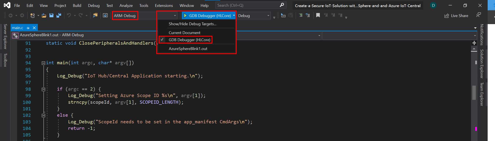
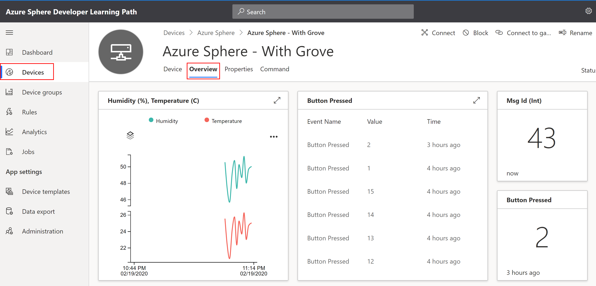

# Send Telemetry from an Azure Sphere to Azure IoT Central


---

Follow me on Twitter [@dglover](https://twitter.com/dglover)

|Author|[Dave Glover](https://developer.microsoft.com/en-us/advocates/dave-glover?WT.mc_id=github-blog-dglover), Microsoft Cloud Developer Advocate |
|:----|:---|
|Cloud Services | Azure IoT Central |
|Hardware | [Seeed Studio Azure Sphere MT3620](https://www.seeedstudio.com/Azure-Sphere-MT3620-Development-Kit-US-Version-p-3052.html), [Seeed Studio Grove Shield](https://www.seeedstudio.com/MT3620-Grove-Shield.html), and the [Grove Temperature and Humidity Sensor (SHT31)](https://www.seeedstudio.com/Grove-Temperature-Humidity-Sensor-SHT31.html) |
|Source Code | https://github.com/gloveboxes/Azure-Sphere-Learning-Path.git |
|Language| C|
|Date| January  2020|

---

## Azure Sphere Learning Path

Each module assumes you have completed the previous module.

* Lab 0: [Introduction Azure Sphere and Lab Set Up](https://github.com/gloveboxes/Azure-Sphere-Learning-Path/tree/master/Lab%200%20-%20Introduction%20and%20Lab%20Set%20Up)
* Lab 1: [Build your first Azure Sphere Application with Visual Studio](https://github.com/gloveboxes/Azure-Sphere-Learning-Path/tree/master/Lab%201%20-%20Build%20your%20first%20Azure%20Sphere%20Application%20with%20Visual%20Studio)
* Lab 2: [Send Telemetry from an Azure Sphere to Azure IoT Central](https://github.com/gloveboxes/Azure-Sphere-Learning-Path/tree/master/Lab%202%20-%20Send%20Telemetry%20from%20an%20Azure%20Sphere%20to%20Azure%20IoT%20Central)
* Lab 3: [Control an Azure Sphere with Device Twins and Direct Methods](https://github.com/gloveboxes/Azure-Sphere-Learning-Path/tree/master/Lab%203%20-%20Control%20an%20Azure%20Sphere%20with%20Device%20Twins%20and%20Direct%20Methods)
* Lab 4: [Azure Sphere Inter-Core Communications](https://github.com/gloveboxes/Azure-Sphere-Learning-Path/tree/master/Lab%204%20-%20Integrating%20FreeRTOS%20with%20Azure%20Sphere%20Inter-Core%20Communications)
* Lab 5: [Automating Azure Sphere Registration with Azure IoT Central](https://github.com/gloveboxes/Azure-Sphere-Learning-Path/tree/master/Lab%205%20-%20Automating%20Azure%20Sphere%20Registration%20with%20Azure%20IoT%20Central)

---

## What you will learn

You will learn how to build an [Azure Sphere](https://azure.microsoft.com/services/azure-sphere/?WT.mc_id=github-blog-dglover) application that sends telemetry to [Azure IoT Central](https://azure.microsoft.com/services/iot-central/?WT.mc_id=github-blog-dglover).

---

## Tutorial Overview

1. Create an Azure IoT Central Application (Free trial)
2. Connect Azure IoT Central with your Azure Sphere Tenant
3. Deploy an Azure IoT Central application to Azure Sphere

---

## Azure IoT

Your Azure Sphere devices can communicate with the Azure IoT with Azure IoT Hub or Azure IoT Central. This tutorial focuses on Azure IoT Central.

This project also uses the Azure Device Provisioning Service (DPS) included with Azure IoT Central. If you are using Azure IoT Hub then you need to create an instance of [Azure Device Provisioning Service](https://docs.microsoft.com/en-us/azure-sphere/app-development/use-azure-iot).

### What is Azure IoT Central

[Azure IoT Central](https://azure.microsoft.com/en-in/services/iot-central/?WT.mc_id=github-blog-dglover) provides an easy way to connect, monitor and manage your Internet of Things (IoT) assets at scale.


---

## Clone the following GitHub Repositories

1. The Azure Sphere Samples

   ```bash
   git clone https://github.com/Azure/azure-sphere-samples.git
   ```

2. This tutorial

    ```bash
    git clone https://github.com/gloveboxes/Create-a-Secure-IoT-Solution-with-Azphere-Sphere-and-and-Azure-IoT-Central.git
    ```

---

## Getting Started with Azure IoT Central

We are going to create an Azure IoT Central application, connect Azure IoT Central to an Azure Sphere Tenant, and finally create a device.

### Step 1: Create an Azure IoT Central Application

Follow instructions to **[Create an Azure IoT Central Application](resources/azure-iot-central/azure-iot-central.md)**

### Step 2: Connect Azure IoT Central and your Azure Sphere Tenant

Any device that is claimed by your Azure Sphere tenant will be automatically enrolled when it first connects to your Azure IoT Central application.

Follow instructions to **[Set up Azure IoT Central to work with Azure Sphere](https://docs.microsoft.com/en-au/azure-sphere/app-development/setup-iot-central)**.

### Step 3: Create an Azure IoT Central Device

From the **Azure Sphere Developer Command Prompt**, type the following command.

```bash
azsphere device show-attached
```

Note: The Create New Device dialog box in Azure IoT Central requires that the device ID be in lowercase characters. From the Azure Sphere Developer Command Prompt, enter the following command, which gets the ID of the attached device and converts it to lowercase:

```bash
powershell -Command ((azsphere device show-attached)[0] -split ': ')[1].ToLower()
```

#### Switch back to Azure IoT Central Web Portal

1. Select Devices from the side menu, then the Device Template previously created.

2. Click **+ New** to add a new device

    Paste in the **device ID** you generated with the PowerShell command into the **Device ID** field and give your device a friendly name.


3. Click **Create** to create the new device.

---

## Deploy the High-Level Azure Sphere Application

### Understanding the High-Level Core Security

Applications on Azure Sphere are locked down by default and you must grant capabilities to the application.

High-Level Application capabilities include what hardware can be accessed, what internet services can be called (including Azure IoT Central and the Azure Device Provisioning Service), and what inter-core communications are allowed.

From Visual Studio open the **app_manifest.json** file.

```json
{
  "SchemaVersion": 1,
  "Name": "AzureSphereIoTCentral",
  "ComponentId": "25025d2c-66da-4448-bae1-ac26fcdd3627",
  "EntryPoint": "/bin/app",
  "CmdArgs": [ "0ne0999999D", "6583cf17-d321-4d72-8283-0b7c5b56442b" ],
  "Capabilities": {
    "Gpio": [ 0, 19, 21 ]
    "Uart": [ "ISU0" ],
    "AllowedConnections": [ "global.azure-devices-provisioning.net", "saas-iothub-99999999-f33a-4002-a44a-9999991b00b6.azure-devices.net" ],
    "DeviceAuthentication": "99999999-e021-43ce-9f2b-999999997494",
    "AllowedApplicationConnections": [ "6583cf17-d321-4d72-8283-0b7c5b56442b" ]
  },
  "ApplicationType": "Default"
}
```

**Observe**:

1. **ComponentId**: A [GUID](https://en.wikipedia.org/wiki/Universally_unique_identifier#Format) to identify the application. This Component ID is referenced in the Real-Time application app_manifest to enable inter-core communications with this High-Level application.
2. **Gpio**: This application uses three GPIO pins. Pins 0 (a relay switch), 19 (blink send status), and 21 (device twin test LED).
3. **Uart**: The Uart is used to communicate with the Seeed Studio Grove Shield.
4. **AllowedConnections**: What internet URLs can be called.
5. **DeviceAuthentication**: Your Azure Sphere Tenant ID.
6. **AllowedApplicationConnections**: This is the Component ID of the Real-Time application this application will be partnered with. It is required for inter-core communications.
7. **CmdArgs**: The first argument is the Azure IoT Central Scope ID. The second argument is the Component ID of the Real-Time application, passed to the application at startup as a convenience to keep all configuration information in one file.

---

## Azure IoT Central Configuration

To connect a device to Azure IoT Hub or IoT Central a Device Connection string is required. For **security** and **manageability** do **NOT** hard code the Azure IoT connection string in your High-Level application.

When you created the device in Azure IoT Central you used the **immutable (unforgeable)** Azure Sphere device ID.

This device ID along with the following information:

1. The Azure IoT Central Scope ID,
2. The Global URL for the Azure Device Provision Service,
3. The URL of your Azure IoT Central Application.

are passed to the Azure Device Provisioning Service (part of Azure IoT Central) from your Azure High-Level application to obtain the Azure IoT Connection string.

### Step 1: Open the High-Level Application with Visual Studio 2019

1. Start Visual Studio 2019, select **Open a local folder**, navigate to the Azure Sphere tutorial project folder you cloned from GitHub, then open the **azure-sphere-hlcore-iot-central** project.
2. Open the **app_manifest.json** file

### Step 2: Azure IoT Central Connection Information

1. Set the **default Azure Sphere Tenant**

    You may need to select the default Azure Sphere Tenant.

    From the **Azure Sphere Developer Command Prompt**, run the ```azsphere tenant list``` command to list available tenants, use the ```azsphere tenant select -i <guid>``` to select the default tenant.

2. Get the **Tenant ID**.

    From the **Azure Sphere Developer Command Prompt**, run the following command.

    ```bash
    azsphere tenant show-selected
    ```

    Copy the returned value and paste it into the **DeviceAuthentication** field of the **app_manifest.json**.

3. Get the **Device Provisioning Service URLs**

    From the **Azure Sphere Developer Command Prompt**, change to the *azure-sphere-samples\Samples\AzureIoT\Tools* folder you previously cloned, and run *ShowIoTCentralConfig.exe*.

    ```bash
    ShowIoTCentralConfig
    ```

    When prompted, log in with the credentials you use for Azure IoT Central. The output of this command will be similar to the following:

    ```text
    Are you using a Work/School account to sign in to your IoT Central Application (Y/N) ?

    Getting your IoT Central applications
    You have one IoT Central application 'yourappname-iot-central'.
    Getting the Device Provisioning Service (DPS) information.
    Getting a list of IoT Central devices.

    Find and modify the following lines in your app_manifest.json:
    "CmdArgs": [ "0ne9992KK6D" ],
    "AllowedConnections": [ "global.azure-devices-provisioning.net", "saas-iothub-9999999-f33a-4002-4444-7ca8989898989.azure-devices.net" ],
    "DeviceAuthentication": "--- YOUR AZURE SPHERE TENANT ID--- ",
    ```

 4.   Find and modify the following lines in your app_manifest.json with the information returned from the ```ShowIoTCentralConfig``` command:

        * "CmdArgs": [ "0ne9992KK6D" ],
        * "AllowedConnections": [ global.azure-devices-provisioning.net", "saas-iothub-9999999-f33a-4002-4444-7ca8989898989.azure-devices.net" ]


```json
{
    "SchemaVersion": 1,
    "Name": "AzureSphereIoTCentral",
    "ComponentId": "25025d2c-66da-4448-bae1-ac26fcdd3627",
    "EntryPoint": "/bin/app",
    "CmdArgs": [ "<YOUR AZURE IOT CENTRAL SCOPE ID>", "6583cf17-d321-4d72-8283-0b7c5b56442b" ],
    "Capabilities": {
        "Gpio": [ 0, 19, 21 ]
        "Uart": [ "ISU0" ],
        "AllowedConnections": [ "global.azure-devices-provisioning.net", "<YOUR AZURE IOT CENTRAL URL>" ],
        "DeviceAuthentication": "<YOUR AZURE SPHERE TENANT ID>",
        "AllowedApplicationConnections": [ "6583cf17-d321-4d72-8283-0b7c5b56442b" ]
    },
    "ApplicationType": "Default"
}
```

---

## Configure Visual Studio App Deployment Settings

Before building the application with Visual Studio ensure ARM-Debug and GDB Debugger (HLCore) options are selected.



### Build, Deploy, and start Debugging

To start the build, deploy, debug process either click the Visual Studio **Start Selected Item** icon or press **F5**. To Build and deploy without attaching the debugger, simply press **Ctrl+F5**.


---

## Azure IoT Central Integration

Now the application is running on the Azure Sphere switch across to Azure IoT Central, select the **Devices** tab, the device template you created, then the actual device. You may have to wait a moment before the telemetry is displayed in the **Measurements** panel.



---

## Finished 完了 fertig finito ख़त्म होना terminado

Congratulations you have finished the tutorial.


---

## Appendix

### Understanding Tutorial Solution

From Visual Studio, open the main.c.

Review the following functions.

1. InitPeripheralsAndHandlers
2. GetTelemetry
3. TwinCallback
4. AzureDirectMethodHandler

#### InitPeripheralsAndHandlers

Sets up SIGTERM termination handler, initialize peripherals, and set up event handlers.

```c
static int InitPeripheralsAndHandlers(void)
{
    struct sigaction action;
    memset(&action, 0, sizeof(struct sigaction));
    action.sa_handler = TerminationHandler;
    sigaction(SIGTERM, &action, NULL);

    epollFd = CreateEpollFd();
    if (epollFd < 0) {
        return -1;
    }

    OpenPeripheral(&sending);
    OpenPeripheral(&relay);
    OpenPeripheral(&light);

    // Initialize Grove Shield and Grove Temperature and Humidity Sensor
    GroveShield_Initialize(&i2cFd, 115200);
    sht31 = GroveTempHumiSHT31_Open(i2cFd);

    StartTimer(&iotClientDoWork);
    StartTimer(&iotClientMeasureSensor);

    return 0;
}
```

#### GetTelemetry

Reads sensor telemetry and returns the data as a JSON object.

```c
static int ReadTelemetry(char eventBuffer[], size_t len) {
    GroveTempHumiSHT31_Read(sht31);
    float temperature = GroveTempHumiSHT31_GetTemperature(sht31);
    float humidity = GroveTempHumiSHT31_GetHumidity(sht31);

    static const char* EventMsgTemplate = "{ \"Temperature\": \"%3.2f\", \"Humidity\": \"%3.1f\", \"MsgId\":%d }";
    return snprintf(eventBuffer, len, EventMsgTemplate, temperature, humidity, msgId++);
}
```

#### TwinCallback

Handles [Azure IoT Hub Device Twins](https://docs.microsoft.com/en-us/azure/iot-hub/iot-hub-devguide-device-twins?WT.mc_id=github-blog-dglover).

In Azure IoT Central, Azure IoT Hub Device Twins are exposed in the user interface as *Settings*.


```c
static void TwinCallback(DEVICE_TWIN_UPDATE_STATE updateState, const unsigned char* payload,
    size_t payloadSize, void* userContextCallback)
{
    JSON_Value* root_value = NULL;
    JSON_Object* root_object = NULL;

    char* payLoadString = (char*)malloc(payloadSize + 1);
    if (payLoadString == NULL) {
        goto cleanup;
    }

    memcpy(payLoadString, payload, payloadSize);
    payLoadString[payloadSize] = 0; //null terminate string

    root_value = json_parse_string(payLoadString);
    if (root_value == NULL) {
        goto cleanup;
    }

    root_object = json_value_get_object(root_value);
    if (root_object == NULL) {
        goto cleanup;
    }


    JSON_Object* desiredProperties = json_object_dotget_object(root_object, "desired");
    if (desiredProperties == NULL) {
        desiredProperties = root_object;
    }

    SetDesiredState(desiredProperties, &relay);
    SetDesiredState(desiredProperties, &light);

cleanup:
    // Release the allocated memory.
    if (root_value != NULL) {
        json_value_free(root_value);
    }
    free(payLoadString);
}
```

#### AzureDirectMethodHandler

Handles [Azure IoT Hub Direct Methods](https://docs.microsoft.com/en-us/azure/iot-hub/iot-hub-devguide-direct-methods?WT.mc_id=github-blog-dglover)

In Azure IoT Central, Azure IoT Hub Direct Methods are exposed in the user interface as *Commands*.


```c
static int AzureDirectMethodHandler(const char* method_name, const unsigned char* payload, size_t payloadSize,
    unsigned char** responsePayload, size_t* responsePayloadSize, void* userContextCallback) {

    const char* onSuccess = "\"Successfully invoke device method\"";
    const char* notFound = "\"No method found\"";

    const char* responseMessage = onSuccess;
    int result = 200;
    JSON_Value* root_value = NULL;
    JSON_Object* root_object = NULL;

    // Prepare the payload for the response. This is a heap allocated null terminated string.
    // The Azure IoT Hub SDK is responsible of freeing it.
    *responsePayload = NULL;  // Response payload content.
    *responsePayloadSize = 0; // Response payload content size.

    char* payLoadString = (char*)malloc(payloadSize + 1);
    if (payLoadString == NULL) {
        responseMessage = "payload memory failed";
        result = 500;
        goto cleanup;
    }

    memcpy(payLoadString, payload, payloadSize);
    payLoadString[payloadSize] = 0; //null terminate string

    root_value = json_parse_string(payLoadString);
    if (root_value == NULL) {
        responseMessage = "Invalid JSON";
        result = 500;
        goto cleanup;
    }

    root_object = json_value_get_object(root_value);
    if (root_object == NULL) {
        responseMessage = "Invalid JSON";
        result = 500;
        goto cleanup;
    }

    if (strcmp(method_name, "fanspeed") == 0)
    {
        int speed = (int)json_object_get_number(root_object, "speed");
        Log_Debug("Set fan speed %d", speed);
    }
    else
    {
        responseMessage = notFound;
        result = 404;
    }

cleanup:

    // Prepare the payload for the response. This is a heap allocated null terminated string.
    // The Azure IoT Hub SDK is responsible of freeing it.
    *responsePayloadSize = strlen(responseMessage);
    *responsePayload = (unsigned char*)malloc(*responsePayloadSize);
    strncpy((char*)(*responsePayload), responseMessage, *responsePayloadSize);

    if (root_value != NULL) {
        json_value_free(root_value);
    }
    free(payLoadString);

    return result;
}
```

### Azure IoT Central Template Settings for Device Twins


