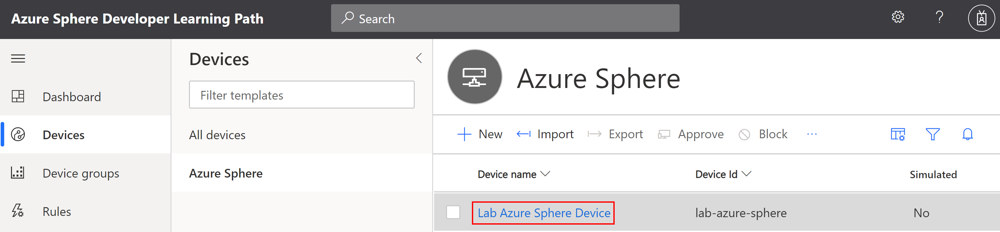
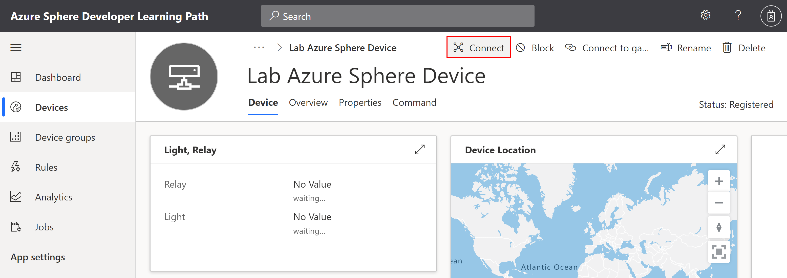
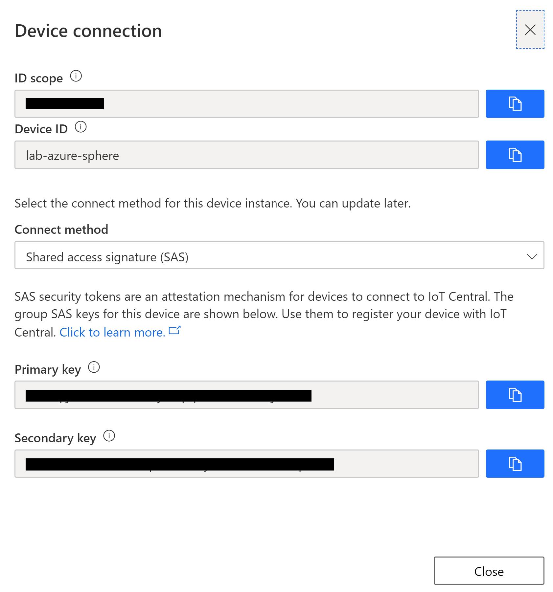
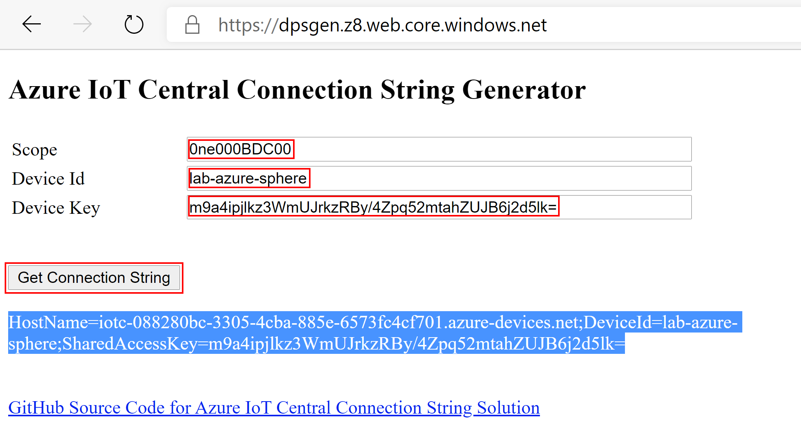

# Connecting a shared Lab Azure Sphere Device

If you are using an Azure Sphere in a lab environment and do not have access to the Azure Sphere tenant the Azure Sphere was claimed into then you need to use a Azure IoT Connection.

The connection string is hard coded in to the application and is there not suitable for product deployments.

---

## Switch back to Azure IoT Central Web Portal

1. Select Devices from the side menu, then the **Azure Sphere** Device Template.
    

2. Click **+ New** to add a new device
3. Set friendly names for the **Device ID** and the **Device name** fields.

    

4. Click **Create** to create the new device.

## Create an Azure IoT Connection String

1. Open the newly created device by clicking on the device name.

    

2. Open the Device Connection information panel by clicking on the **Connect** button.

    

3. The device connection configuration will be displayed.

    

4. **Right mouse click** and open the [Azure IoT Central Connection String Generator](https://dpsgen.z8.web.core.windows.net/) in a **new browser tab**.

5. Copy and paste the **Device Connection** information (Scope Id, Device ID, and Primary Key) from Azure IoT Central to the **Azure IoT Central Connection String Generator**.

6. Click **Get Connection String**

    

7. Mark and copy the connection string as you will need to paste into the Visual Studio Azure Sphere project.
