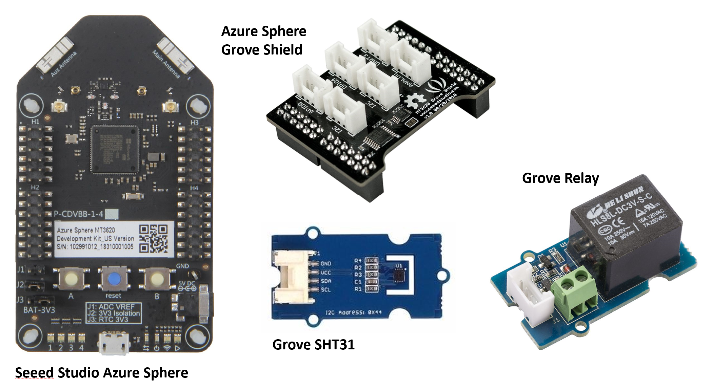

---

**Follow** me on **Twitter** [@dglover](https://twitter.com/dglover)

|Author|[Dave Glover](https://developer.microsoft.com/en-us/advocates/dave-glover?WT.mc_id=github-blog-dglover), Microsoft Cloud Developer Advocate |
|:----|:---|
|Target Platform | Seeed Studio Azure Sphere MT3620 |
|Target Service | [Azure IoT Central](https://azure.microsoft.com/services/iot-central/?WT.mc_id=github-blog-dglover) |
|Developer Platform | Windows 10 or Ubuntu 18.04 |
|Azure SDK | Azure Sphere SDK 20.01 or better |
|Developer Tools| [Visual Studio (The free Community Edition or better)](https://visualstudio.microsoft.com/vs/?WT.mc_id=github-blog-dglover) or [Visual Studio Code (Free OSS)](https://code.visualstudio.com?WT.mc_id=github-blog-dglover)|
|Hardware | [Seeed Studio Grove Shield](https://www.seeedstudio.com/MT3620-Grove-Shield.html), and the [Grove Temperature and Humidity Sensor (SHT31)](https://www.seeedstudio.com/Grove-Temperature-Humidity-Sensor-SHT31.html) |
|Source Code | https://github.com/gloveboxes/Azure-Sphere-Learning-Path.git |
|Language| C|
|Date| January  2020|

---

## Azure Sphere Learning Path

Each module assumes you have completed the previous module.

[Home](https://gloveboxes.github.io/Azure-Sphere-Learning-Path/)

* Lab 0: [Introduction Azure Sphere and Lab Set Up](https://github.com/gloveboxes/Azure-Sphere-Learning-Path/tree/master/Lab%200%20-%20Introduction%20and%20Lab%20Set%20Up)
* Lab 1: [Build your first Azure Sphere Application with Visual Studio](https://github.com/gloveboxes/Azure-Sphere-Learning-Path/tree/master/Lab%201%20-%20Build%20your%20first%20Azure%20Sphere%20Application%20with%20Visual%20Studio)
* Lab 2: [Send Telemetry from an Azure Sphere to Azure IoT Central](https://github.com/gloveboxes/Azure-Sphere-Learning-Path/tree/master/Lab%202%20-%20Send%20Telemetry%20from%20an%20Azure%20Sphere%20to%20Azure%20IoT%20Central)
* Lab 3: [Control an Azure Sphere with Device Twins and Direct Methods](https://github.com/gloveboxes/Azure-Sphere-Learning-Path/tree/master/Lab%203%20-%20Control%20an%20Azure%20Sphere%20with%20Device%20Twins%20and%20Direct%20Methods)
* Lab 4: [Integrating FreeRTOS with Azure Sphere Inter-Core Messaging](https://github.com/gloveboxes/Azure-Sphere-Learning-Path/tree/master/Lab%204%20-%20Integrating%20FreeRTOS%20with%20Azure%20Sphere%20Inter-Core%20Messaging)
* Lab 5: [Automating Azure Sphere Registration with Azure IoT Central](https://github.com/gloveboxes/Azure-Sphere-Learning-Path/tree/master/Lab%205%20-%20Automating%20Azure%20Sphere%20Registration%20with%20Azure%20IoT%20Central)

[Next](https://github.com/gloveboxes/Azure-Sphere-Learning-Path/tree/master/Lab%201%20-%20Build%20your%20first%20Azure%20Sphere%20Application%20with%20Visual%20Studio)

---

## Why Azure Sphere

As billions of new devices are connected, organizations need to secure them to help protect data, privacy, physical safety, and infrastructure. Azure Sphere builds on decades of Microsoft experience in hardware, software, and cloud to provide a turnkey solution for IoT devices. Get defense in depth to embrace IoT innovation with confidence.

---

## Why you should care about IoT Security

Almost a day doesn't go by without some newsworthy IoT Security attack happening, and those are just the ones that make the news cycle. IoT security is absolutely fundamental and at the same time often absent from many conversations in the rush to get products to market.

The [The Seven Properties of Highly Secure Devices](https://www.microsoft.com/en-us/research/wp-content/uploads/2017/03/SevenPropertiesofHighlySecureDevices.pdf) is highly recommended to help you understand what is required to mitigate exposure to IoT security issues. This IoT Security whitepaper draws from industry and Microsoft experience.

Here's one of the most unconventional: a fish tank. Not just an ordinary fish tank, mind you, but a fairly high-tech one that featured Internet connectivity. That connection allowed the tank to be remotely monitored, automatically adjust temperature and salinity, and automate feedings.

It also allowed hackers to swipe 10 gigabytes of data from the North American casino that just installed it, according to a report from the threat intelligence experts at [Darktrace](http://www.darktrace.com/).

[Criminals Hacked A Fish Tank To Steal Data From A Casino](https://www.forbes.com/sites/leemathews/2017/07/27/criminals-hacked-a-fish-tank-to-steal-data-from-a-casino/#46045c1d32b9)

---

## What is Azure Sphere

Azure Sphere is a solution for securing MCU Power Devices. It comprises a secured, connected, crossover microcontroller unit (MCU), a custom high-level Linux-based operating system (OS), and a cloud-based security service that provides continuous, renewable security.

Growing ecosystem of hardware partners.

---

## Azure Sphere Architecture

---

## Hardware Required

This Learning Path requires either a Azure Sphere Developer kit from [Seeed Studio](https://www.seeedstudio.com/Azure-Sphere-MT3620-Development-Kit-US-Version-p-3052.html) or [Avnet](https://www.avnet.com/shop/us/products/avnet-engineering-services/aes-ms-mt3620-sk-g-3074457345636825680/).

### Avnet Azure Sphere MT3620 Starter Kit

There Avnet board includes Temperature and Humidity Sensors.

### Seeed Studio Azure Sphere Developer Kit

[Seeed Studio Azure Sphere](https://www.seeedstudio.com/Azure-Sphere-MT3620-Development-Kit-US-Version-p-3052.html), the [Seeed Studio Grove Shield](https://www.seeedstudio.com/MT3620-Grove-Shield.html), and the [Grove Temperature and Humidity Sensor (SHT31)](https://www.seeedstudio.com/Grove-Temperature-Humidity-Sensor-SHT31.html). These parts are available from many online stores including [Seeed Studio](https://www.seeedstudio.com).

Be sure to plug the Grove Temperature Sensor into one of the I2C connectors on the Grove Shield.

