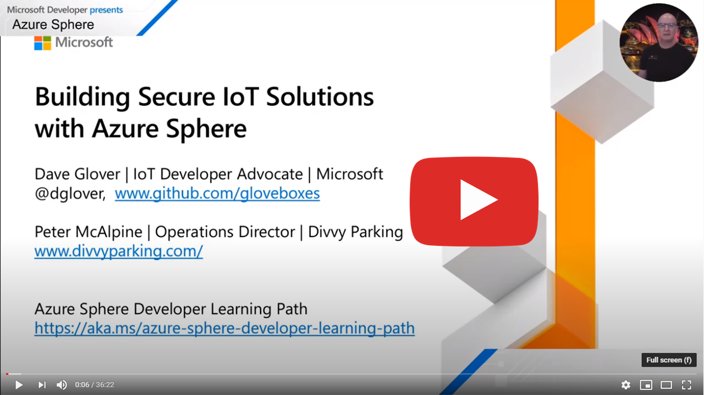
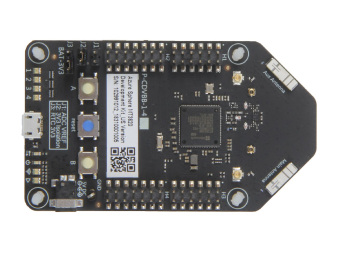

---

**Follow** me on **Twitter** [@dglover](https://twitter.com/dglover)

|Author|[Dave Glover](https://developer.microsoft.com/en-us/advocates/dave-glover?WT.mc_id=julyot-azd-dglover), Microsoft Cloud Developer Advocate |
|:----|:---|
|Target Platform | Azure Sphere MT3620 |
|Target Service | [Azure IoT Central](https://azure.microsoft.com/services/iot-central/?WT.mc_id=julyot-azd-dglover) |
|Developer Platform | Windows 10 or Ubuntu 18.04/20.04 |
|Azure SDK | Azure Sphere SDK 20.07 or better |
|Developer Tools| [Visual Studio (The free Community Edition or better)](https://visualstudio.microsoft.com/vs/?WT.mc_id=julyot-azd-dglover) or [Visual Studio Code (Free OSS)](https://code.visualstudio.com?WT.mc_id=julyot-azd-dglover)|
|Supported Hardware | [Avnet Azure Sphere MT3620 Starter Kit](https://www.avnet.com/shop/us/products/avnet-engineering-services/aes-ms-mt3620-sk-g-3074457345636825680) [Seeed Studio Azure Sphere MT3620 Development Kit](https://www.seeedstudio.com/Azure-Sphere-MT3620-Development-Kit-US-Version-p-3052.html) and the [Seeed Studio MT3620 Mini Dev Board](https://www.seeedstudio.com/MT3620-Mini-Dev-Board-p-2919.html) |
|Source Code | [https://github.com/gloveboxes/Azure-Sphere-Learning-Path.git](https://github.com/gloveboxes/Azure-Sphere-Learning-Path.git) |
|Language| C|
|Licence | [Review full MIT Licence](LICENSE). In summary. You are free to use, modify, and contribute back to the code in this project. No liability accepted.
|Date| May 2020 |

---

## Learn more about Azure Sphere

[Azure Sphere](https://azure.microsoft.com/en-au/services/azure-sphere/?WT.mc_id=julyot-azd-dglover) is a comprehensive IoT security solution – including hardware, OS, and cloud components – to actively protect your devices, your business, and your customers.

Azure Sphere is made up of three interrelated components:

1. Azure Sphere-certified MCUs
2. Azure Sphere OS
3. Azure Sphere Security Service

These components are backed by Microsoft best-in-class security experts who monitor emerging threats, design updates and provide a decade of ongoing servicing.

---

## Azure Sphere Developer Learning Path

This Azure Sphere developer learning path is designed to ease you into the world of Azure Sphere development.

Your journey starts with the equivalent of hello world, the next step is sending telemetry to Azure IoT, then you will learn how to securely control a device from Azure IoT, and finally connect and send Azure IoT Events from a FreeRTOS application.

Each lab assumes you have completed the previous lab.

You are also free to use and modify the code provided in this learning path for your projects, commercial or otherwise, no liability accepted.

Learning path overview:

* Lab 0: Lab Set Up
* Lab 1: Introduction to Azure Sphere development
* Lab 2: Connect a room environment monitor to Azure IoT
* Lab 3: Set the room virtual thermostat with Azure IoT Device Twins
* Lab 4: Remote reboot your Azure Sphere with Azure IoT Direct Methods
* Lab 5: Integrate FreeRTOS Real-time room sensors with Azure IoT
* Lab 6: Integrate Azure RTOS Real-time room sensors with Azure IoT
* Lab 7: Connect and control your room environment monitor with Azure IoT
<!-- * Lab 8: Over-the-air (OTA) Deployment -->

* [Recommended path for Windows users with Visual Studio 2019 and IoT Central](docs/zdocs_visual_studio_iot_central/Lab_0_Introduction_and_Lab_Set_Up/README.md)
* [Recommended path for Linux users with Visual Studio Code and IoT Central](docs/zdocs_vs_code_iot_central/Lab_0_Introduction_and_Lab_Set_Up/README.md)
* [Recommended path for Linux and Windows users with Visual Studio Code and IoT Hub](docs/zdocs_vs_code_iot_hub/Lab_0_Introduction_and_Lab_Set_Up/README.md)

---

## Why Azure Sphere

As billions of new devices are connected, organizations need to secure them to help protect data, privacy, physical safety, and infrastructure. Azure Sphere builds on decades of Microsoft experience in hardware, software, and cloud to provide a turnkey solution for IoT devices. Azure Sphere is secure by design so you can build innovative IoT products that customers can use with confidence.

---

## Why you should care about IoT security

Almost a day doesn't go by without some newsworthy IoT security attack happening, and those are just the ones that make the news cycle. IoT security is fundamental and at the same time often absent from many conversations in the rush to get products to market.

[The Seven Properties of Highly Secure Devices](https://www.microsoft.com/en-us/research/wp-content/uploads/2017/03/SevenPropertiesofHighlySecureDevices.pdf?WT.mc_id=julyot-azd-dglover) is highly recommended to help you understand what is required to mitigate exposure to IoT security issues. This IoT Security whitepaper draws from industry and Microsoft experience.

Here is one of the most unconventional: a fish tank. Not just an ordinary fish tank, mind you, but a high-tech one that featured Internet connectivity. That connection allowed the tank to be remotely monitored, automatically adjust temperature and salinity, and automate feedings.

It also allowed hackers to swipe 10 gigabytes of data from the North American casino that just installed it, according to a report from the threat intelligence experts at [Darktrace](http://www.darktrace.com/).

[Criminals Hacked A Fish Tank To Steal Data From A Casino](https://www.forbes.com/sites/leemathews/2017/07/27/criminals-hacked-a-fish-tank-to-steal-data-from-a-casino/#46045c1d32b9)

<!-- ---

## What is Azure Sphere

Azure Sphere is a solution for securing MCU Power Devices. It comprises a secured, connected, crossover microcontroller unit (MCU), a custom high-level Linux-based operating system (OS), and a cloud-based security service that provides continuous, renewable security.

 -->

---

## The Growing ecosystem of hardware partners

Get started with Azure Sphere using the prototyping developer kits from Avnet and Seeed Studio. Build solutions with industry standard modules from [AI-Link](https://www.mouser.com/new/seeed-studio/seeed-studio-mt3620-iot-module/?utm_source=RSS&utm_medium=RSS+Feed&utm_campaign=180935404), [Avnet](https://www.avnet.com/shop/us/products/avnet-engineering-services/aes-ms-mt3620-m-g-tr-3074457345641969195/), and [USI](https://www.usiglobal.com/en/new?new_id=06af2dfc-9cb3-4cb8-97cd-23db4b0a665d). Internet enable existing equipment with the [Avnet Guardian module](https://www.avnet.com/shop/us/products/avnet-engineering-services/aes-ms-mt3620-guard-100-3074457345641694219).

Today the Mediatec MT3620 MCU powers Azure Sphere. The family of certified Azure Sphere MCUs will expand to include offerings from Qualcomm and NXP.

---

## Azure Sphere in Action

### Divvy Parking

[Divvy Parking](https://www.divvyparking.com/), based in Australia, are building a multipurpose PCB based on the [Avnet Azure Sphere](https://www.avnet.com/shop/us/products/avnet-engineering-services/aes-ms-mt3620-m-g-tr-3074457345641969195/) module.

This PCB will initially support their parking solution, controlling boom gates and detecting vehicles as well as other monitor and control applications in car parks. However, it will suit any IoT application where monitoring and control of legacy equipment is needed, and is available for third party integrator to purchase.

Building solutions with pre-certified Azure Sphere modules is the fastest way to bring a secure IoT product to market.

*Prototype PCB design included here with the permission of Divvy Parking*

### Starbucks and the Avnet Azure Sphere Guardian Module

[Starbucks turns to technology to brew up a more personal connection with its customers](https://news.microsoft.com/transform/starbucks-turns-to-technology-to-brew-up-a-more-personal-connection-with-its-customers/?WT.mc_id=julyot-azd-dglover)

---

## Youtube Building Secure IoT Solutions with Azure Sphere

Click on the following image to start watching the introduction session to building secure solutions with Azure Sphere.

---

## Azure Sphere Architecture

The initial release of the Azure Sphere is built on the Mediatec MT3620. This MCU consists of 5 cores. There is a dedicated communications core, a dedicated Security Subsystem core, and **three** user application cores.

The **three applications cores** are as follows:

* One ARM Cortex A7 core running Embedded Linux (built with Yokto), exposing a set of POSIX APIs. Developers can build and deploy a **High Level** application to this core. This core is also responsible for the TrustZone Security Monitor, threat detection reporting, and OS and Application life cycle management.
* Two ARM Cortex M4Fs. Developers can build and deploy **Real Time** applications to these cores. Real Time applications can be built against the bare metal or built using  real time frameworks such as FreeRTOS, and in the future, Azure RTOS.

With Visual Studio you can develop and debug applications running on all three cores. For example, you can simultaneously debug an app running on the A7 core and a M4 core FreeRTOS app.

The MT3620 MCU is also known as a Crossover MCU as it bridges the application world of ARM Cortex A7 with the Real time world of ARM Cortex M4.

### Security

* Applications on Azure Sphere are locked down by default and you must grant capabilities to the application. This is key to Azure Sphere security and is also known as the [Principle of least privilege](https://en.wikipedia.org/wiki/Principle_of_least_privilege).

* Capabilities, such as access to GPIO pins and network endpoint must be granted to both High Level and Real Time applications. This defends against application bugs and malicious code attacks.

* The chip includes a Memory Management Unit (MMU) to provide protected memory address spaces.

* Measured boot ensures only signed/certified OS components are loaded as part of the boot sequence.

* Only signed and verified apps can run on the microcontroller cores.

<!--  -->

---

## Azure Sphere Devices

For simplicity, only the LEDs and sensors built into the Azure Sphere developer boards are used in these labs. These labs do not require any expansion boards or extra sensors.

The following Azure Sphere developer boards are supported by these labs, and for completeness, links to expansion options for each developer board.

| [Avnet Azure Sphere MT3620 Starter Kit](https://www.avnet.com/shop/us/products/avnet-engineering-services/aes-ms-mt3620-sk-g-3074457345636825680/) | [Seeed Studio Azure Sphere MT3620 Development Kit](https://www.seeedstudio.com/mt3620-for-azure-sphere) | [Seeed Studio Seeed Studio MT3620 Mini Dev Board](https://www.seeedstudio.com/mt3620-for-azure-sphere) |
| :-------------: | :---------------: | :-----: |
| [Reference](https://www.avnet.com/shop/us/products/avnet-engineering-services/aes-ms-mt3620-sk-g-3074457345636825680/) | [Reference](http://wiki.seeedstudio.com/Azure_Sphere_MT3620_Development_Kit/) | [Reference](http://wiki.seeedstudio.com/MT3620_Mini_Dev_Board/) |
|  |  |  |
| [Mikroe Click Boards](https://www.mikroe.com/) and Seeed Grove I2C | [Grove Starter Kit for Azure Sphere MT3620 Development Kit](http://wiki.seeedstudio.com/Grove_Starter_Kit_for_Azure_Sphere_MT3620_Development_Kit/) | [MT3620 Grove Breakout](https://www.seeedstudio.com/MT3620-Grove-Breakout-p-4043.html) |
|  |   |  |

<!-- --- -->

<!-- ## Supported Starter/Developer Kits

These labs support the following Azure Sphere Kits.

| Manufacturer | Image |
|---|---|
| [Avnet Azure Sphere MT3620 Starter Kit](https://www.avnet.com/shop/us/products/avnet-engineering-services/aes-ms-mt3620-sk-g-3074457345636825680/). This starter kit includes a 3D accelerometer, a 3D Gyro, along with temperature, pressure, and ambient light sensors. | |
| [Seeed Studio Azure Sphere MT3620 Development Kit](http://wiki.seeedstudio.com/Azure_Sphere_MT3620_Development_Kit/) |  |
| [Seeed Studio Azure Sphere MT3620 Mini Dev Board]() |  | -->

---

## Appendix

### Azure Sphere Articles

1. [Why Azure Sphere From Microsoft Is A Big Deal For The IoT Ecosystem](https://www.forbes.com/sites/janakirammsv/2020/02/25/why-azure-sphere-from-microsoft-is-a-big-deal-for-the-iot-ecosystem/#6063a8c15f1b)

### Learn about Azure Sphere

1. [Azure Sphere Documentation](https://docs.microsoft.com/en-au/azure-sphere/?WT.mc_id=julyot-azd-dglover)
1. Using Yocto to Build an IoT OS Targeting a Crossover SoC. [Video](https://www.youtube.com/watch?v=-T7Et5qfqQQ), and [Slides](https://static.sched.com/hosted_files/ossna19/91/Crossover_ELC2019.pdf)
1. [Anatomy of a secured MCU](https://azure.microsoft.com/en-au/blog/anatomy-of-a-secured-mcu/?WT.mc_id=julyot-azd-dglover)
1. [Azure Sphere’s customized Linux-based OS](https://azure.microsoft.com/en-au/blog/azure-sphere-s-customized-linux-based-os/?WT.mc_id=julyot-azd-dglover)
1. [Tech Communities Blog](https://techcommunity.microsoft.com/t5/internet-of-things/bg-p/IoTBlog?WT.mc_id=julyot-azd-dglover)
1. The [Azure IoT Central Sample](https://github.com/Azure/azure-sphere-samples/blob/master/Samples/AzureIoT/IoTCentral.md)
1. [Azure Sphere Wiki](https://en.wikipedia.org/wiki/Azure_Sphere)

---

**[Next](zdocs/Lab_0_Introduction_and_Lab_Set_Up/README.md)**

---