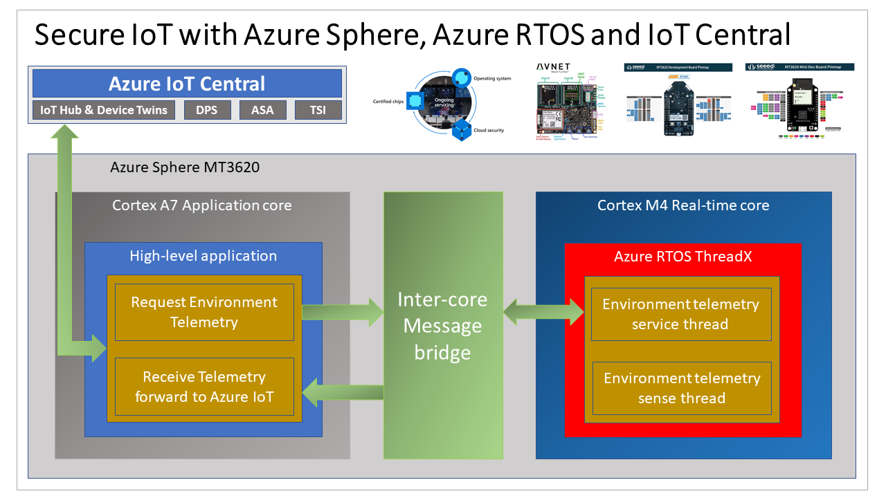

# Lab 6: Integrate Azure RTOS Real-time room sensors with Azure IoT

<!--  -->

---

**Author**: [Dave Glover](https://developer.microsoft.com/en-us/advocates/dave-glover?WT.mc_id=julyot-azd-dglover), Microsoft Cloud Developer Advocate, [@dglover](https://twitter.com/dglover)

---

## Azure Sphere Learning Path

Each module assumes you have completed the previous module.

[Home](../../../README.md)

* Lab 0: [Lab Set Up](../Lab_0_Introduction_and_Lab_Set_Up/README.md)
* Lab 1: [Introduction to Azure Sphere development](../Lab_1_Visual_Studio_and_Azure_Sphere/README.md)
* Lab 2: [Connect a room environment monitor to Azure IoT](../Lab_2_Send_Telemetry_to_Azure_IoT_Central/README.md)
* Lab 3: [Set the room virtual thermostat with Azure IoT Device Twins](../Lab_3_Control_Device_with_Device_Twins/README.md)
* Lab 4: [Remote reboot your Azure Sphere with Azure IoT Direct Methods](../Lab_4_Control_Device_with_Direct_Methods/README.md)
* Lab 5: [Integrate FreeRTOS Real-time room sensors with Azure IoT](../Lab_5_FreeRTOS_and_Inter-Core_Messaging/README.md)
* Lab 6: [Integrate Azure RTOS Real-time room sensors with Azure IoT](../Lab_6_AzureRTOS_and_Inter-Core_Messaging/README.md)
* Lab 7: [Connect and control your room environment monitor with Azure IoT](../Lab_7_Azure_IoT_Central_RTOS_Integration/README.md)
<!-- * Lab 8: [Over-the-air (OTA) Deployment](/docs/Lab_8_Over-the-air-deployment/README.md) -->

---

## Acknowledgements

This lab builds on the [MediaTek MT3620 M4 Driver & Real-Time Application Sample Code](https://github.com/MediaTek-Labs/mt3620_m4_software)

---

## What you will learn

You will learn how to deploy a [Azure RTOS](https://azure.microsoft.com/en-us/services/rtos/?WT.mc_id=julyot-azd-dglover) application to an Azure Sphere Cortex M4 Real-Time core.

You can run Bare Metal applications or applications built on Real-Time frameworks such as FreeRTOS and Azure RTOS on the Azure Sphere Real-Time cores.

The main reason you would run an application on a Real-Time core is when you need precise or highly deterministic timing. For example, you have a sensor driver that requires precise timing.

For security, applications running on Real-Time cores do not have direct internet access. They communicate with the internet via a High-Level application.

 In this lab, you will also learn about **Intercore** messaging.

---

## Prerequisites

You should have completed the set up steps in Lab 0. You should have:

1. Enabled the Real-Time Core debugger
2. Enabled the Real-Time Core Floating Point Toolchain

## How to install the real time tool chain on Linux

1. Download the [GNU Arm Embedded Toolchain](https://developer.arm.com/tools-and-software/open-source-software/developer-tools/gnu-toolchain/gnu-rm/downloads)
2. Install the downloaded package. The following installs the toolchain in the /opt directory.

    ```bash
    sudo tar -xjvf gcc-arm-none-eabi-9-2020-q2-update-x86_64-linux.tar.bz2 -C /opt
    ```

3. Update your path. Open ~/.bashrc and at the end add.

    ```bash
    export PATH=$PATH:/opt/gcc-arm-none-eabi-9-2020-q2-update/bin
    ```

---

## Enable Real-Time Core Development

### Step 1: Enable Real-Time Core Debugging

1. On Windows, start the **Azure Sphere Developer Command Prompt** as **Administrator**. On Linux, you will be promoted for the superuser password.
1. **Enable Real-Time core debugging**

    ```bash
    azsphere device enable-development -r
    ```

1. Exit the command prompt. Type **exit**, and then press return.

<!-- ### Step 2: Enable the Real-Time Core Floating Point Toolchain

Copy the **AzureSphereRTCoreToolchainVFP.cmake** file found in the **Azure Sphere Learning Path** directory you just cloned to the Azure Sphere SDK CMakeFiles directory. The default destination directory is **C:\Program Files (x86)\Microsoft Azure Sphere SDK\CMakeFiles**. -->

---

## Tutorial Overview

1. Deploy your first Real-Time Core Azure RTOS Application to Azure Sphere.

---

## Azure Sphere Architecture

The Azure Sphere is built on the Mediatec MT3620. This crossover MCU consists of 5 cores. There is a dedicated communications core, a dedicated Security Subsystem core, and **three** user application cores.

The **three applications cores** are as follows:

* 1 x  ARM Cortex A7 core running Embedded Linux (built with Yokto), exposing a set of POSIX APIs. Developers can build and deploy a **High-level** application to this core. This core is also responsible for the TrustZone Security Monitor, threat detection reporting, and OS and Application life cycle management.
* 2 x ARM Cortex M4Fs. Developers can build and deploy **Real-time** applications to these cores. Real-time applications can be built against the bare metal or built using  Real-time frameworks such as Azure RTOS ThreadX.

With [Visual Studio](https://visualstudio.microsoft.com/downloads/?WT.mc_id=julyot-rover-dglover) (free community edition or better) or [Visual Studio Code](https://code.visualstudio.com/?WT.mc_id=julyot-rover-dglover), you can develop and debug applications running on all three cores. For example, you can simultaneously debug an app running on the A7 core and a M4 core Azure RTOS ThreadX app.


---


## Key Concepts

In this lab, you will learn how to secure, deploy, and debug a **Real-Time** Azure RTOS application running on one of the Azure Sphere **Cortex M4** Real-Time cores.

As a reminder, the Azure Sphere has three application cores. The Cortex A7 runs High-Level applications, the two Cortex M4s run Real-Time applications.

Like High-Level applications, Real-Time core applications are locked down by default, so you need to grant permissions to access hardware resources.

For security, applications running on Real-Time cores cannot connect directly to **any** network.

In this lab and the next, you will learn about  **Intercore** messaging. Intercore messaging provides a secure channel for applications running on different cores to communicate.

## Solution architecture



**UPDATE AS LIFTED FROM ULTRASONIC PROJECT**


### Real-time Azure RTOS ThreadX Application

* The Real-time Azure RTOS ThreadX application running on one of the M4 cores that is responsible for running the timing-sensitive HC-SR04 ultrasonic distance sensor.
* Distance is measured every 20 milliseconds so the rover can decide the best route.
* The sensor requires precise microsecond timing to trigger the distance measurement process, so it is a perfect candidate for running on the Real-time core as a Azure RTOS ThreadX thread.
* Every 5 seconds a Azure RTOS ThreadX thread sends distance telemetry to the Azure Sphere A7 High-level application.

### Azure IoT High-level Application

* The application running on the Azure Sphere A7 High-level application core is responsible for less timing-sensitive tasks such as establishing WiFi/Network connectivity, negotiating security and connecting with Azure IoT Central, updating the device twin and send telemetry messages.


---

## What is an RTOS (Real-Time Operating System)

A Real-Time Operating System is system software that provides services and manages processor resources for applications. These resources include processor cycles, memory, peripherals, and interrupts. The main purpose of a Real-Time Operating System is to allocate processing time among various duties the embedded software must perform. 

This typically involves a division of the software into pieces, commonly called “tasks” or “threads,” and creating a run-time environment that provides each thread with its own virtual microprocessor (“Multithreading”). Basically, a virtual microprocessor consists of a virtual set of microprocessor resources, e.g., register set, program counter, stack memory area, and a stack pointer. Only while executing does a thread use the physical microprocessor resources, but each thread retains its own copy of the contents of these resources as if they were its own private resources (the thread”s “context”).

### To learn more

To learn more about what an RTOS read the [Real-Time Operating System - What it is and why you might want to use one](https://azure.microsoft.com/en-au/resources/real-time-operating-system/) article.

---

## Inter-Core Messaging Security

The Azure RTOS application will send **Button Pressed** events to the **Partner** High-Level application. The High-Level application will then forward the events to Azure IoT Central on behalf of the Azure RTOS application.

Both the Azure RTOS application running on the Real-Time core and the High-Level application need **Inter-Core** messaging permissions. The **app_manifest.json** property **AllowedApplicationConnections** of both applications must include the _Component ID_ of the **Partner** application.

### Real-Time intercore capabilities

In the following Azure RTOS Real-Time **app_manifest.json** file, the **AllowedApplicationConnections** property is set to the Component ID of the High-Level application.

```json
{
  "SchemaVersion": 1,
  "Name": "demo_threadx",
  "ComponentId": "6583cf17-d321-4d72-8283-0b7c5b56442b",
  "EntryPoint": "/bin/app",
  "CmdArgs": [],
  "Capabilities": {
    "Gpio": [ ],
    "I2cMaster": [ "$I2cMaster2" ],
    "AllowedApplicationConnections": [ "25025d2c-66da-4448-bae1-ac26fcdd3627" ]
  },
  "ApplicationType": "RealTimeCapable"
}

```

### High-Level intercore capabilities

The following is the High-Level **app_manifest.json** file, the **AllowedApplicationConnections** property is set to the Component ID of the Azure RTOS Real-Time application.

```json
{
  "SchemaVersion": 1,
  "Name": "AzureSphereIoTCentral",
  "ComponentId": "25025d2c-66da-4448-bae1-ac26fcdd3627",
  "EntryPoint": "/bin/app",
  "CmdArgs": [
    "--ConnectionType", "DPS", "--ScopeID", "Your_ID_Scope",
	  "--RTComponentId", "6583cf17-d321-4d72-8283-0b7c5b56442b"
  ],
  "Capabilities": {
    "Gpio": [
      "$NETWORK_CONNECTED_LED",
      "$LED_RED",
      "$LED_GREEN",
      "$LED_BLUE"
    ],
    "PowerControls": [
      "ForceReboot"
    ],
    "AllowedConnections": [
      "global.azure-devices-provisioning.net"
    ],
    "DeviceAuthentication": "Replace_with_your_Azure_Sphere_Tenant_ID",
    "AllowedApplicationConnections": [ "6583cf17-d321-4d72-8283-0b7c5b56442b" ]
  },
  "ApplicationType": "Default"
}
```

---

## Step 1: Delete the existing applications on the Azure Sphere

1. There will be some GPIO pin reassignments between the existing High-Level application that is running on the Azure Sphere and the new Real-Time application that will be deployed to the Azure Sphere in this lab. So delete any existing applications on the Azure Sphere to avoid any clashes.

    From the **Azure Sphere Developer Command Prompt**, run

    ```bash
    azsphere device sideload delete
    ```
2. Restart the Azure Sphere. From the **Azure Sphere Developer Command Prompt**, run

    ```bash
    azsphere device restart
    ```

---

## Step 2: Open the lab project

1. Click **Open folder**.
2. Open the Azure-Sphere lab folder.
3. Open the **Lab_3_Device_Twins** folder.
4. Click **Select Folder** or the **OK** button to open the project.

    

### Step 3: Set your developer board configuration

These labs support developer boards from AVNET and Seeed Studio. You need to set the configuration that matches your developer board.

The default developer board configuration is for the AVENT Azure Sphere Starter Kit. If you have this board, there is no additional configuration required.

1. Open CMakeList.txt
    
2. Add a # at the beginning of the set AVNET line to disable it.
3. Uncomment the **set** command that corresponds to your Azure Sphere developer board.

    ```text
    set(AVNET TRUE "AVNET Azure Sphere Starter Kit")
    # set(SEEED_STUDIO_RDB TRUE "Seeed Studio Azure Sphere MT3620 Development Kit (aka Reference Design Board or rdb)")
    # set(SEEED_STUDIO_MINI TRUE "Seeed Studio Azure Sphere MT3620 Mini Dev Board")
    ```

4. Save the file. This will auto-generate the CMake cache.

### Step 4: Deploy the Azure RTOS Application to Azure Sphere

1. Ensure main.c is open.
2. Select **CMake: [Debug]: Ready** from the Visual Studio Code Status Bar.

    

3. From Visual Studio Code, press <kbd>F5</kbd> to build, deploy, start, and attached the remote debugger to the application now running the Azure Sphere device.

---

## Step 5: Debugging Real-Time Core Applications

You can Debug the Azure RTOS application running on Azure Sphere Cortex M4 Real-Time Core.

1. From Visual Studio Code, navigate to the **demo_threadx** directory, and open the **demo_azure_rtos.c** file.
2. Scroll down to the function named **intercore_thread**.
3. Set a [Visual Studio Code Breakpoint](https://code.visualstudio.com/docs/editor/debugging#_breakpoints&WT.mc_id=julyot-azd-dglover) in the intercore_thread function on the line that reads **switch (ic_control_block.cmd)**

    

4. Leave Visual Studio Code and the app running with the breakpoint set. Next we are going to deploy a High Level app application to the Cortex A7 core which will request enviroment telemtry from the Real Time app running on the Cortex M4 core.

---

## Finished 已完成 fertig 完了 finito समाप्त terminado

Congratulations you have finished lab 4.


---

**[NEXT](../Lab_7_Azure_IoT_Central_RTOS_Integration/README.md)**

---
