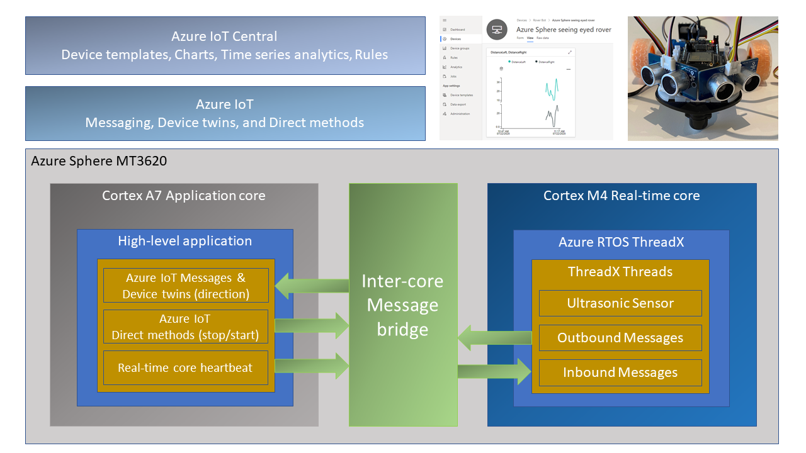
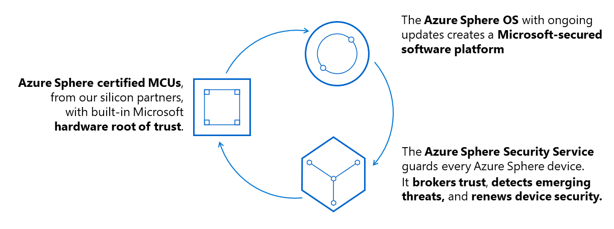
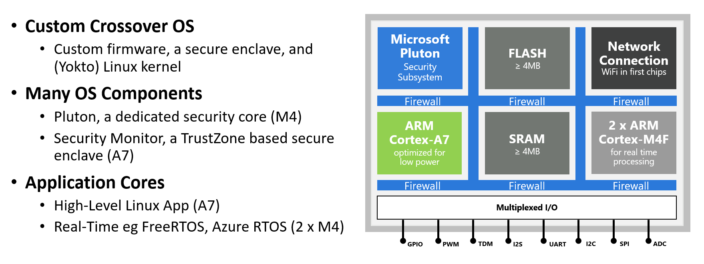
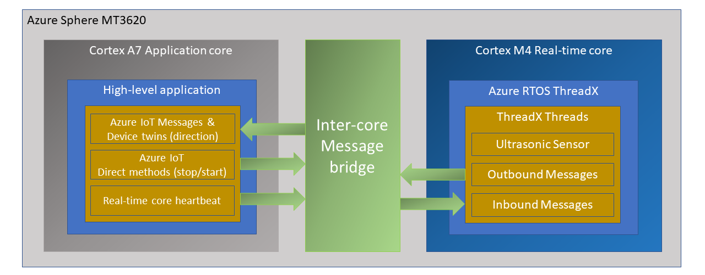
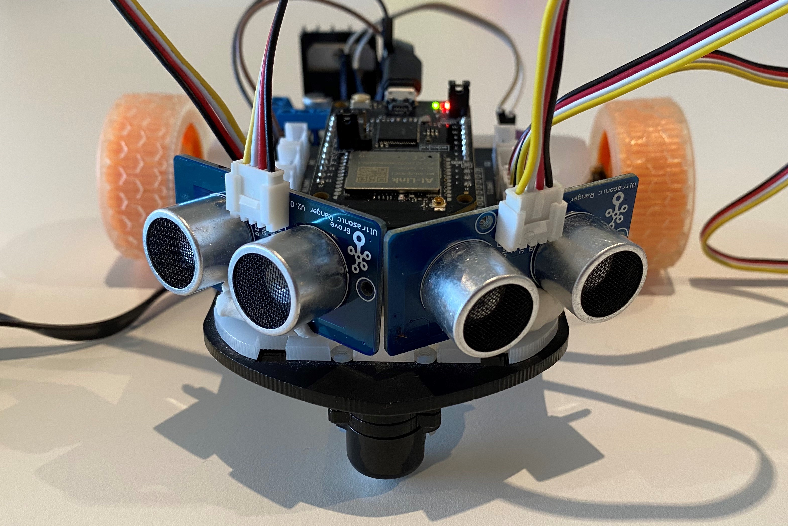
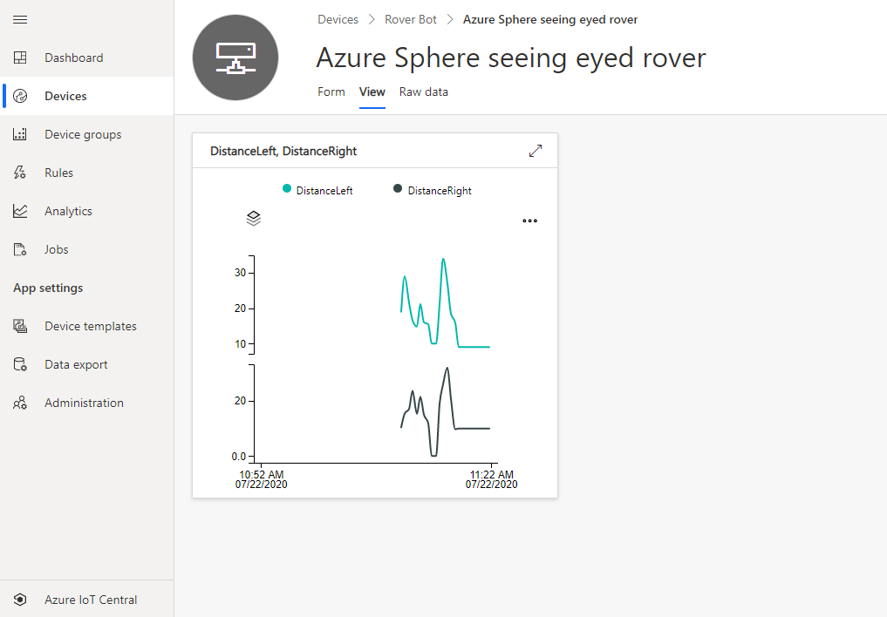

# Secure IoT with Azure RTOS ThreadX, Azure Sphere, and Azure IoT

Better together, learn how to build a secure IoT solution with Azure RTOS ThreadX and Azure Sphere.



---

## What you will learn

You will learn how to integrate a Real-time Azure RTOS ThreadX application responsible for running a timing-sensitive ultrasonic distance sensor with the security and cloud connectivity of Azure Sphere.

---

## #JulyOT

This is part of the #JulyOT [IoT Tech Community](http://aka.ms/julyot) series, a collection of blog posts, hands-on-labs, and videos designed to demonstrate and teach developers how to build projects with Azure Internet of Things (IoT) services. Please also follow [#JulyOT](https://twitter.com/hashtag/JulyOT) on Twitter.

---

## Source code and learning resources

Source code: [Azure Sphere seeing eyed rover Real-time Azure RTOS ThreadX sensors and Azure IoT](https://github.com/gloveboxes/Azure-Sphere-Azure-RTOS-ThreadX-Real-time-Ultrasonic-Rover).

Learning resources: [Azure Sphere Developer Learning Path](https://github.com/gloveboxes/Azure-Sphere-Learning-Path).

---

## Learn more about Azure Sphere

[Azure Sphere](https://azure.microsoft.com/en-au/services/azure-sphere/?WT.mc_id=julyot-rover-dglover) is a comprehensive IoT security solution – including hardware, OS, and cloud components – to actively protect your devices, your business, and your customers.

Azure Sphere is made up of three interrelated components:

1. Azure Sphere-certified MCUs
2. Azure Sphere OS
3. Azure Sphere Security Service



---

## Azure Sphere Architecture

The Azure Sphere is built on the Mediatec MT3620. This crossover MCU consists of 5 cores. There is a dedicated communications core, a dedicated Security Subsystem core, and **three** user application cores.

The **three applications cores** are as follows:

* 1 x  ARM Cortex A7 core running Embedded Linux (built with Yokto), exposing a set of POSIX APIs. Developers can build and deploy a **High-level** application to this core. This core is also responsible for the TrustZone Security Monitor, threat detection reporting, and OS and Application life cycle management.
* 2 x ARM Cortex M4Fs. Developers can build and deploy **Real-time** applications to these cores. Real-time applications can be built against the bare metal or built using  Real-time frameworks such as Azure RTOS ThreadX and Azure RTOS.

With [Visual Studio](https://visualstudio.microsoft.com/downloads/?WT.mc_id=julyot-rover-dglover) (free community edition or better) or [Visual Studio Code](https://code.visualstudio.com/?WT.mc_id=julyot-rover-dglover), you can develop and debug applications running on all three cores. For example, you can simultaneously debug an app running on the A7 core and a M4 core Azure RTOS ThreadX app.



---

## Application architecture

The application running on the Azure Sphere consists of two parts.



### Real-time Azure RTOS ThreadX Application

* The Real-time Azure RTOS ThreadX application running on one of the M4 cores that is responsible for running the timing-sensitive HC-SR04 ultrasonic distance sensor.
* Distance is measured every 20 milliseconds so the rover can decide the best route.
* The sensor requires precise microsecond timing to trigger the distance measurement process, so it is a perfect candidate for running on the Real-time core as a Azure RTOS ThreadX thread.
* Every 5 seconds a Azure RTOS ThreadX thread sends distance telemetry to the Azure Sphere A7 High-level application.

### Azure IoT High-level Application

* The application running on the Azure Sphere A7 High-level application core is responsible for less timing-sensitive tasks such as establishing WiFi/Network connectivity, negotiating security and connecting with Azure IoT Central, updating the device twin and send telemetry messages.

### Extending

* I am thinking about extending this solution with a local TinyML module for smarter navigation.

---

## Parts list

* 1 x [Seeed Studio MT3620 Mini Dev Board](https://www.seeedstudio.com/mt3620-for-azure-sphere)
* 1 x [MT3620 Grove Breakout](https://www.seeedstudio.com/MT3620-Grove-Breakout-p-4043.html)
* 2 x [Grove - Ultrasonic Distance Sensor](https://www.seeedstudio.com/Grove-Ultrasonic-Distance-Sensor.html)
* 1 x H-Bridge driver. Seeed Studio have a [Grove - I2C Motor Driver](https://wiki.seeedstudio.com/Grove-I2C_Motor_Driver_V1.3/), or you can wire up your own H-Bridge connector to the Grove Breakout board.
* 1 x Rover chassis, motors, wheels etc



---

## Azure IoT Central

[Azure IoT Central](https://azure.microsoft.com/en-in/services/iot-central/?WT.mc_id=julyot-rover-dglover) provides an easy way to connect, monitor, and manage your Internet of Things (IoT) assets at scale.

I created a free trial of [Azure IoT Central](https://azure.microsoft.com/en-gb/services/iot-central/?WT.mc_id=julyot-rover-dglover) and in no time I had the rover distance sensor charted and available for deeper analysis. By the way, you can continue to connect two devices for free to IoT Central after the trial period expires.



### Extend and integrate Azure IoT Central applications with other cloud services

Azure IoT Central is also extensible using rules and workflows. For more information, review [Use workflows to integrate your Azure IoT Central application with other cloud services](https://docs.microsoft.com/en-us/azure/iot-central/core/howto-configure-rules-advanced?WT.mc_id=julyot-rover-dglover)

---

## How to build the solution

1. Set up your [Azure Sphere development environment](https://github.com/gloveboxes/Azure-Sphere-Learning-Path/tree/master/zdocs_visual_studio_iot_central/Lab_0_Introduction_and_Lab_Set_Up).
2. Review [Integrate Azure RTOS ThreadX Real-time room sensors with Azure IoT](https://github.com/gloveboxes/Azure-Sphere-Learning-Path/tree/master/zdocs_vs_code_iot_central/Lab_6_AzureRTOS_and_Inter-Core_Messaging).
3. Learn how to connect and Azure Sphere to [Azure IoT Central](https://github.com/gloveboxes/Azure-Sphere-Learning-Path/tree/master/zdocs_visual_studio_iot_central/Lab_2_Send_Telemetry_to_Azure_IoT_Central) or [Azure IoT Hub](https://github.com/gloveboxes/Azure-Sphere-Learning-Path/tree/master/zdocs_vs_code_iot_hub/Lab_2_Send_Telemetry_to_Azure_IoT_Hub).
4. The IoT Central Device Template Capabilities Model JSON file for this solution is included in the **iot_central** directory of this repo.

---

## How to install the real time tool chain on Linux

1. Download the [GNU Arm Embedded Toolchain](https://developer.arm.com/tools-and-software/open-source-software/developer-tools/gnu-toolchain/gnu-rm/downloads)
2. Install the downloaded package. I install in the /opt directory.

    ```bash
    sudo tar -xjvf gcc-arm-none-eabi-9-2020-q2-update-x86_64-linux.tar.bz2 -C /opt
    ```

3. Update your path. Open ~/.bashrc and at the end add.

    ```bash
    export PATH=$PATH:/opt/gcc-arm-none-eabi-9-2020-q2-update/bin
    ```

---

## How to update to the latest ThreadX bits

### How to determine current ThreadX version

1. Open tx_api.h.

    ```c
    /**************************************************************************/
    /*                                                                        */
    /*  APPLICATION INTERFACE DEFINITION                       RELEASE        */
    /*                                                                        */
    /*    tx_api.h                                            PORTABLE C      */
    /*                                                           6.0.1        */
    ```

### Download latest bits

Clone the ThreadX GitHub repo 

```bash
git clone https://github.com/azure-rtos/threadx.git
```

1. Update the [Cortex M4 bits](https://github.com/azure-rtos/threadx/tree/master/ports/cortex_m4/gnu)
2. Update the [ThreadX common bits](https://github.com/azure-rtos/threadx/tree/master/common)

### Customise for Azure Sphere

1. Open **tx_initialize_low_level.S**
2. Change **SYSTEM_CLOCK      =   200000000**
3. Comment out @    .global     __RAM_segment_used_end__ and the related code, as there is no such symbol in the .ld file. It's likely these areas are already commented out.

    ```asm
    @    .global     __RAM_segment_used_end__
    ```

    and

    ```asm
    @
    @    /* Set base of available memory to end of non-initialised RAM area.  */
    @     
    @    LDR     r0, =_tx_initialize_unused_memory       @ Build address of unused memory pointer
    @    LDR     r1, =__RAM_segment_used_end__           @ Build first free address   
    @    ADD     r1, r1, #4                              @ 
    @    STR     r1, [r0]                                @ Setup first unused memory pointer
    @
    ```

---

## How to update to the latest MediaTec bits

[MediaTek MT3620 M4 Driver & Real-Time Application Sample Code](https://github.com/MediaTek-Labs/mt3620_m4_software)

MediaTec regularly update the MT3620 M4 drivers and samples.

### Enabling the System Tick Handler

Open the MT3620_M4_BSP/scr/nvic.c file

Search for 

```c
void SystmTick_Handler(void)
{
	sys_tick_in_ms++;
	#ifdef OSAI_FREERTOS
	extern void SysTick_Handler(void);
	SysTick_Handler();
	#endif
}
```

Comment out the ifdef/endif directives to enable the system tick handler for Azure ThreadX.

```
void SystmTick_Handler(void)
{
	sys_tick_in_ms++;
	//#ifdef OSAI_FREERTOS
	extern void SysTick_Handler(void);
	SysTick_Handler();
	//#endif
}
```

## Tips and tricks

### Milliseconds to ticks

```c
/* Convert from millisecond to ThreadX Tick value. */
#define MS_TO_TICK(ms)  ((ms) * (TX_TIMER_TICKS_PER_SECOND) / 1000)
```

### Ticks per millisecond

1 tick = 10ms. It is configurable.

---

Have fun and stay safe and be sure to follow us on [#JulyOT](https://twitter.com/hashtag/JulyOT?src=hash&ref_src=twsrc%5Etfw).
