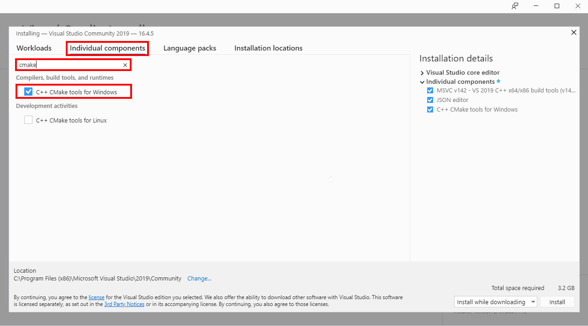

# Lab 0: Lab set up, installation and configuration

|Author|[Dave Glover](https://developer.microsoft.com/en-us/advocates/dave-glover?WT.mc_id=github-blog-dglover), Microsoft Cloud Developer Advocate, [@dglover](https://twitter.com/dglover) |
|:----|:---|
|Date| March 2020 |

---

## Azure Sphere Learning Path

Each module assumes you have completed the previous module.

[Home](https://github.com/gloveboxes/Azure-Sphere-Learning-Path/blob/master/README.md)

* Lab 0: [Introduction Azure Sphere and Lab Set Up](/zdocs/Lab_0_Introduction_and_Lab_Set_Up/README.md)
* Lab 1: [Build your first Azure Sphere Application with Visual Studio](/zdocs/Lab_1_Visual_Studio_and_Azure_Sphere/README.md)
* Lab 2: [Send Telemetry from an Azure Sphere to Azure IoT Central](/zdocs/Lab_2_Send_Telemetry_to_Azure_IoT_Central/README.md)
* Lab 3: [Control an Azure Sphere with Device Twins and Direct Methods](/zdocs/Lab_3_Control_Device_with_Device_Twins_and_Direct_Methods/README.md)
* Lab 4: [Integrating FreeRTOS with Azure Sphere Inter-Core Messaging](/zdocs/Lab_4_FreeRTOS_and_Inter-Core_Messaging/README.md)
* Lab 5: [Integrating FreeRTOS with Azure IoT Central](/zdocs/Lab_5_FreeRTOS_and_Azure_IoT_Central/README.md)
* Lab 6: [Over-the-air (OTA) Deployment](/zdocs/Lab_6_Over-the-air-deployment/README.md)

---

## Acknowledgements

### Azure Sphere Samples

These **Azure Sphere Learning Path** labs build on the [Azure Sphere Samples](https://github.com/Azure/azure-sphere-samples). You will find full scenario and API coverage in the samples documentation.

---

## Documentation

### Azure Sphere Documentation

Full [Azure Sphere Documentation](https://azure.microsoft.com/en-au/services/azure-sphere/?WT.mc_id=github-blog-dglover).

### Azure Sphere (azsphere) Command Line Reference

[Overview of azsphere command-line utility](https://docs.microsoft.com/en-us/azure-sphere/reference/overview?WT.mc_id=github-blog-dglover).

---

## Troubleshooting

1. If you have trouble connecting to the Azure Sphere over USB be sure to disable any VPNs you might have enabled.
2. The **TAP-Windows Adapter V9** installed with VPN clients, including OpenVPN client is not compatible with the **TAP-Windows Adapter V9** required and installed by the Azure Sphere SDK for Visual Studio. You will need to uninstall the VPN client and reinstall the Azure Sphere SDK for Visual Studio.

---

## Prerequisites

1. Windows 10 Anniversary Update or later, or Ubuntu 18.04 LTS
2. An Azure Sphere device

---

## Azure Sphere Tenant Credentials

### Personal Azure Sphere Device

If you have your own Azure Sphere device you will need the credentials you used when you claimed your device into an Azure Sphere Tenant.

### Shared Lab Azure Sphere Device

If you are using a shared lab device, then the lab instructor will tell you the Azure Sphere Tenant credentials you will need for the lab.

---

## Step 1: Install Software

You can develop applications for Azure Sphere on Windows 10 Anniversary Update or later, or a Linux machine running Ubuntu 18.04 LTS

### Windows 10 Users

Install the following software.

1. [Visual Studio (The free Community Edition or better)](https://visualstudio.microsoft.com/vs/?WT.mc_id=github-blog-dglover).
    * No specific **Workloads** options are required.
    * Select **Individual components**.
    * Type *cmake* in search box.
    * Select **C++ CMake tools for Windows**.
    * Click install.
    
2. [Azure Sphere SDK for Visual Studio](https://docs.microsoft.com/en-au/azure-sphere/install/install-sdk?WT.mc_id=github-blog-dglover#azure-sphere-sdk-for-visual-studio)
3. [Git for Windows](https://git-scm.com/downloads)
4. [Install Azure Sphere drivers for Windows](https://docs.microsoft.com/en-au/azure-sphere/install/install-sdk?WT.mc_id=github-blog-dglover)

### Ubuntu 18.04 Users

Install the following software.

1. [Visual Studio Code](https://code.visualstudio.com/?WT.mc_id=github-blog-dglover)
2. [Azure Sphere Extension for Visual Studio Code](https://marketplace.visualstudio.com/items?itemName=ms-vscode.azure-sphere-tools&WT.mc_id=github-blog-dglover).
3. [CMake Tools Extension for Visual Studio Code](https://marketplace.visualstudio.com/items?itemName=ms-vscode.cmake-tools&WT.mc_id=github-blog-dglover)
4. [Install the Azure Sphere SDK on Linux](https://docs.microsoft.com/en-au/azure-sphere/install/install-sdk-linux?WT.mc_id=github-blog-dglover)
5. [Set up your Linux system for app development](https://docs.microsoft.com/en-au/azure-sphere/install/development-environment-linux?WT.mc_id=github-blog-dglover)
6. Install Git support **```apt install git```**.

For complete instructions follow the Azure Sphere [Overview of set up procedures](https://docs.microsoft.com/en-au/azure-sphere/install/overview?WT.mc_id=github-blog-dglover) guide.

---

## Step 2: Set up Azure Sphere Tenant and Login

### Azure Sphere Developer Command Prompt

To start the Azure Sphere Developer Command prompt

1. Press the <kbd>Windows Key</kbd>
2. Start typing **Azure Sphere Developer Command Prompt**
3. Select and start the **Azure Sphere Developer Command Prompt**.

### Create a new Tenant User

**Skip this step if you are using a lab device or you have already claimed your Azure Sphere.**

From the **Azure Sphere Developer Command Prompt**:

```bash
azsphere login --newuser <email@address.com>
```

### Create a new Tenant

**Skip this step if you are using a lab device or you have already claimed your Azure Sphere.**

From the **Azure Sphere Developer Command Prompt**:

```bash
azsphere tenant create -n <tenant_name>
```

### Login to your Azure Sphere Tenant

You will need the credentials for the Azure Sphere Tenant your device was claimed into.

If you are using a lab device, then the lab instructor will provide you with the credentials.

From the **Azure Sphere Developer Command Prompt**:

```bash
azsphere login
```

You will be prompted for the Azure Sphere Tenant credentials.

### Select the default Azure Sphere Tenant

From the **Azure Sphere Developer Command Prompt**:

1. List Azure Sphere Tenants, run

    ```bash
    azsphere tenant list
    ```

2. Select the default Azure Sphere Tenant

    **Skip this step if there was only one tenant listed in the previous step.**

    If there is more than one tenant listed then you need to set the default tenant. You need to copy the ID from the ```azsphere tenant list``` command you ran in the previous step. Run

    ```bash
    azsphere tenant select -i <Tenant ID>
    ```

---

## Step 3: Claim your Azure Sphere

**Skip this step if you are using a lab device or you have already claimed your Azure Sphere.**

**Note**, claiming an Azure Sphere device is a one-time operation. The device will become associated with an Azure Sphere Tenant and the email address you used when you claimed the device.

You **cannot move** the device to another Azure Tenant once it has been claimed. However, you can add additional [users and roles](https://docs.microsoft.com/en-us/azure-sphere/deployment/add-tenant-users?WT.mc_id=github-blog-dglover) to the Azure Sphere tenant, including users with Admin rights.

1. From the **Azure Sphere Developer Command Prompt**, run

    ```bash
    azsphere device claim
    ```

For more information visit [Claim your Azure Sphere device](https://docs.microsoft.com/en-au/azure-sphere/install/claim-device?WT.mc_id=github-blog-dglover).

---

## Step 4: Configure the Azure Sphere WiFi Network

From the **Azure Sphere Developer Command Prompt**:

1. Scan for WiFi Access Points

    ```bash
    azsphere device wifi scan
    ```

2. To add a new WiFi network connection. Run

    ```bash
    azsphere device wifi add -s <Your WiFi SSID> -p <Your WiFI Password>
    ```

3. Check WiFi connection status. Run

    ```bash
    azsphere device wifi show-status
    ```

    
4. List the existing WiFi network connections. Run

    ```bash
    azsphere device wifi list
    ```

For more information on networking, visit [Configure the Azure Sphere WiFi Settings](https://docs.microsoft.com/en-au/azure-sphere/install/configure-wifi?WT.mc_id=github-blog-dglover)

---

## Step 5: Update Azure Sphere OS

As of April 2020, your device should be version **20.03** or better.

From the **Azure Sphere Developer Command Prompt**:

1. Check the device OS version

    ```bash
    azsphere device show-os-version
    ```

2. If the device is not up to date, then restart to trigger the update process. Run

    ```bash
    azsphere device restart
    ```

3. It will take a few minutes for the update to be applied. Then recheck the OS version.

    ```bash
    azsphere device show-os-version
    ```

---

## Step 6: Check WiFi Network Connection after update

Check that the WiFi network connection is active.

```bash
azsphere device wifi show-status
```

If there is no network connection then repeat step 6.

---

## Step 7: Delete any existing applications on the Azure Sphere

1. From the **Azure Sphere Developer Command Prompt**, run

    ```bash
    azsphere device sideload delete
    ```

2. Restart the Azure Sphere. From the **Azure Sphere Developer Command Prompt**, run

    ```bash
    azsphere device restart
    ```

---

## Step 8: Enable High Level Core Device Debugging

From the **Azure Sphere Developer Command Prompt**, run

```bash
azsphere device enable-development
```

---

## Step 9: Clone the Azure Sphere Learning Path

**WARNING**: On Windows, clone the *Azure Sphere Learning Path* to a directory close to the root directory on your computer. For example **c:\lab**. The reason is the Azure Sphere build process uses CMake which does not support Windows 10 long path/folder names.

```bash
git clone --depth 1 https://github.com/gloveboxes/Azure-Sphere-Learning-Path.git Azure-Sphere
```

---

## Step 10: Review the Azure Learning Path Directory Layout

The labs support the three currently available developer kits from Avnet and Seeed Studio.

**Ensure you use the labs that match your hardware.**

Lab directories are named by Azure Sphere device manufacturer.

    Azure-Sphere
    |- AVNET
    |- SEEED
    |- SEEED-MINI


---

**[NEXT](../Lab_1_Visual_Studio_and_Azure_Sphere/README.md)**

---
