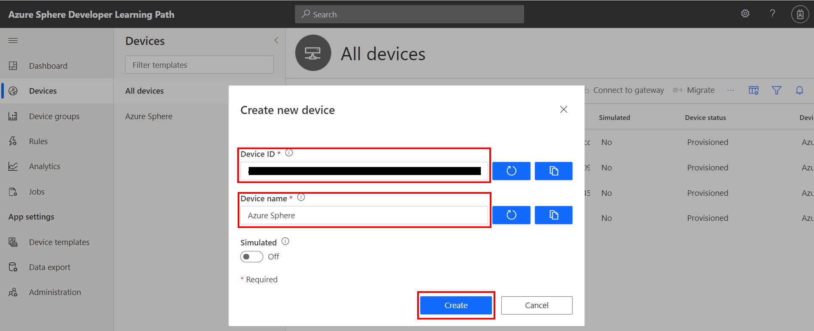
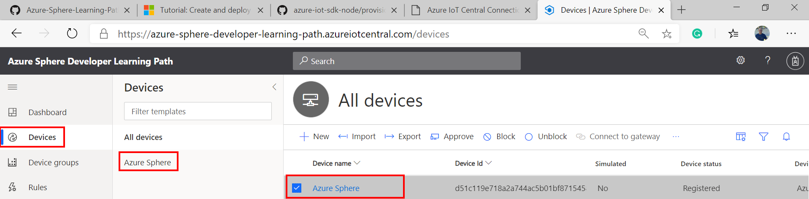
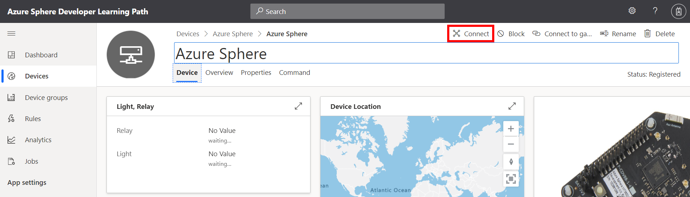
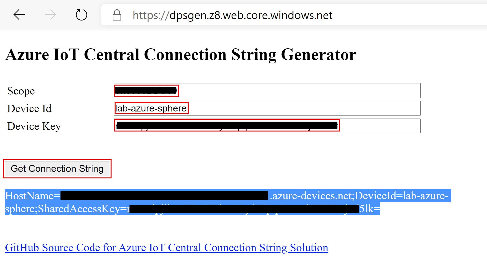

# Lab 2: Send Telemetry from an Azure Sphere to Azure IoT Central

<!--  -->

---

|Author|[Dave Glover](https://developer.microsoft.com/en-us/advocates/dave-glover?WT.mc_id=github-blog-dglover), Microsoft Cloud Developer Advocate, [@dglover](https://twitter.com/dglover) |
|:----|:---|
|Source Code | https://github.com/gloveboxes/Azure-Sphere-Learning-Path.git |
|Date| March 2020|

---

## Azure Sphere Learning Path

Each module assumes you have completed the previous module.

[Home](https://github.com/gloveboxes/Azure-Sphere-Learning-Path/blob/master/README.md)

* Lab 0: [Introduction Azure Sphere and Lab Set Up](/zdocs/Lab_0_Introduction_and_Lab_Set_Up/README.md)
* Lab 1: [Build your first Azure Sphere Application with Visual Studio](/zdocs/Lab_1_Visual_Studio_and_Azure_Sphere/README.md)
* Lab 2: [Send Telemetry from an Azure Sphere to Azure IoT Central](/zdocs/Lab_2_Send_Telemetry_to_Azure_IoT_Central/README.md)
* Lab 3: [Control an Azure Sphere with Device Twins and Direct Methods](/zdocs/Lab_3_Control_Device_with_Device_Twins_and_Direct_Methods/README.md)
* Lab 4: [Integrating FreeRTOS with Azure Sphere Inter-Core Messaging](/zdocs/Lab_4_FreeRTOS_and_Inter-Core_Messaging/README.md)
* Lab 5: [Integrating FreeRTOS with Azure IoT Central](/zdocs/Lab_5_FreeRTOS_and_Azure_IoT_Central/README.md)
* Lab 6: [Mass Device Deployment with Azure IoT Central](/zdocs/Lab_6_Mass_Device_Deployment/README.md)

---

## What you will learn

You will learn how to build a High-Level [Azure Sphere](https://azure.microsoft.com/services/azure-sphere/?WT.mc_id=github-blog-dglover) application that connects and sends telemetry to [Azure IoT Central](https://azure.microsoft.com/services/iot-central/?WT.mc_id=github-blog-dglover).

---

## Prerequisites

The lab assumes you understand the content from [Lab 1: Secure, Build, Deploy and Debug your first Azure Sphere High-Level Application with Visual Studio](../Lab_1_Visual_Studio_and_Azure_Sphere/README.md)

## Tutorial Overview

1. How to create an Azure IoT Central Application from a template.

2. Enabling trust between your Azure Sphere Tenant and your Azure IoT Central Application for automatic device enrollment.

3. Whitelisting the Azure IoT Central Application URL endpoint.

4. Configuring the Azure Sphere Application to connect to Azure IoT Central.

---

## Key Concepts

### Azure IoT

Your Azure Sphere device can securely connect and communicate with cloud services. Azure Sphere includes built-in library support for both Azure IoT Hub and Azure IoT Central. This lab focuses on Azure IoT Central.

This project leverages the [Azure IoT Hub Device Provisioning Service (PDS)](https://docs.microsoft.com/en-us/azure-sphere/app-development/use-azure-iot?WT.mc_id=github-blog-dglover), which is included with Azure IoT Central. The Device Provisioning Service (DPS) enables zero-touch, just-in-time, large scale device provisioning.

### Azure IoT Central

[Azure IoT Central](https://azure.microsoft.com/en-in/services/iot-central/?WT.mc_id=github-blog-dglover) provides an easy way to connect, monitor, and manage your Internet of Things (IoT) assets at scale.


---

## Getting started with Azure IoT Central

We are going to create an Azure IoT Central application from an application template. 
>See [Define a new IoT device type in your Azure IoT Central application](https://docs.microsoft.com/en-us/azure/iot-central/core/howto-set-up-template) for information on creating your own device templates.

---

## Step 1: Create an Azure IoT Central Application

For this lab, we are going to create an Azure IoT Central Application from a predefined template.

Right mouse click [Azure Sphere Learning Path Azure IoT Central Template](https://apps.azureiotcentral.com/build/new/dba50ef5-fb7d-4260-8a5e-a4592677af4f) to open the link in a new browser tab.

### Configure the Azure IoT Central Template

1. Name your application.
2. Select the **Free** pricing plan.
3. Complete any required fields.
4. Click **Create** to create the Azure IoT Central Application.


<!-- When you have connected your Azure Sphere to Azure IoT Central you will be able to visualize the device telemetry.

 -->

<!-- Follow instructions to **[Create an Azure IoT Central Application](resources/azure-iot-central/azure-iot-central.md)** -->

---

## Step 2: Trust all devices in your Azure Sphere Tenant

We need to tell Azure IoT Central to trust all devices in your Azure Sphere Tenant.

After you have completed this step, any device that is claimed by your Azure Sphere tenant will be automatically enrolled when it first connects to your Azure IoT Central application.

### Download the tenant authentication CA certificate

1. Open an **Azure Sphere Developer Command Prompt**
2. Download the Certificate Authority (CA) certificate for your Azure Sphere tenant:

    ```bash
    azsphere tenant download-CA-certificate --output CAcertificate.cer
    ```

    The output file must have the .cer extension.

### Upload the tenant CA certificate to Azure IoT Central and generate a verification code

1. In Azure IoT Central, go to Administration > Device Connection > Manage primary certificate.

2. Click the folder icon next to the Primary box and navigate to the certificate you downloaded. If you don't see the .cer file in the list, make sure that the view filter is set to All files (*). Select the certificate and then click the gear icon next to the Primary box.

3. The Primary Certificate dialog box appears. The Subject and Thumbprint fields contain information about the current Azure Sphere tenant and primary root certificate.

4. Click the Refresh icon to the right of the Verification Code box to generate a verification code. Copy the verification code to the clipboard.

    

### Verify the tenant CA certificate

1. Return to the Azure Sphere Developer Command Prompt.

2. Download a validation certificate that proves that you own the tenant CA certificate. Replace code in the command with the verification code from the previous step.

    ```bash
    azsphere tenant download-validation-certificate --output ValidationCertification.cer --verificationcode <code>
    ```
3. The Azure Sphere Security Service signs the validation certificate with the verification code to prove that you own the CA.

### Use the validation certificate to verify the tenant identity

1. Return to Azure IoT Central and click Verify.
2. When prompted, navigate to the validation certificate that you downloaded in the previous step and select it. When the verification process is complete, the Primary Certificate dialog box displays the Verified message. Click Close to dismiss the box.

    

After you complete these steps, any device that is claimed into your Azure Sphere tenant will automatically be enrolled in your Azure IoT Central application when it first connects.

---

## Step 3: Whitelist the Azure IoT Central Application Endpoint

Remember, applications on Azure Sphere are locked down by default, including hardware and network endpoints.

You must whitelist the network endpoint of your Azure IoT Central application otherwise your Azure Sphere Application will not be able to connect to it.

In this step, we are going to create a dummy device and use that device to obtain the Azure IoT Central Application URL that we will whitelist.

<!-- ### Create an Azure Sphere Device

1. Start the **Azure Sphere Developer Command Prompt**
2. Run the **```azsphere device show-attached```** command. This returns the Azure Sphere Device Id.
3. Next, run **```powershell -Command ((azsphere device show-attached)[0] -split ': ')[1].ToLower()```**.
This returns the **Device ID** and converts it to lowercase. Azure IoT Central requires device IDs to be lowercase.
4. **Copy** the **Device ID** to the clipboard. -->

### Create an Azure IoT Central Device

1. Switch back to Azure IoT Central Web Portal.
2. Select **Devices** from the side menu.
3. Select the **Azure Sphere** device template
    .
4. Click **+ New** to add a new device.
5. Set the **Device ID** name to _Dummy-Device_, or something similar.
6. Leave the default **Device Name**.
7. Click **Create** to create the new device.

    

### Get the Azure IoT Central Application URL to Whitelist

1. Open the newly created device by clicking on the device name.
    
2. Open the Device Connection information panel by clicking on the **Connect** button.
    
3. The device connection configuration will be displayed.
    
4. **Right mouse click** and open the [Azure IoT Central Application URL](https://azuredps.z23.web.core.windows.net) in a **new browser tab**.

5. Copy and paste the **Device Connection** information (Scope, Device Id, and Key) from Azure IoT Central to the **Azure IoT Central Application URL** web page.

6. Click **Get Azure IoT Central Application URL**

    

7. Leave this page open as you will need the Azure IoT Central Application URL soon.

### Step 4: Get the Azure Sphere Tenant ID

We need the ID of the Azure Sphere Tenant that is now trusted by Azure IoT Central.

1. From the **Azure Sphere Developer Command Prompt**, run **```azsphere tenant show-selected```**.
    * The output of this command will look similar to the following.
        ```text
        Default Azure Sphere tenant ID is 'yourSphereTenant' (99999999-e021-43ce-9999-fa9999499994).
        ```
    * The **Tenant ID** is the numeric value inside the parentheses.
2. **Copy the Tenant ID to _Notepad_** as you will need it soon.

---

## Azure IoT Central Device Templates

A device template is a blueprint that defines the characteristics and behaviors of a type of device that connects to an Azure IoT Central application.

For more information on device templates, review the [Define a new IoT device type in your Azure IoT Central application](https://docs.microsoft.com/en-us/azure/iot-central/core/howto-set-up-template) article. 


1. From Azure IoT Central, navigate to **Device template**, and select the **Azure Sphere** template.
2. Click on **Interfaces** to list the interface capabilities.
3. Explore the IoT Central device template interfaces, properties, and views.


---

## Azure IoT Central Events

Azure IoT Central can be configured to treat some telemetry as events. You would typically use these for alerts or notifications. For example, an emergency button was pressed.

### Step 1: Defining Azure IoT Central Interface Events

Defined in the Azure IoT Central Device template, under Interface, ButtonA and ButtonB are configured as **Events**.


### Step 2: Generating Azure IoT Central Events

Review the handler function **ButtonPressCheckHandler**. The following code sends the Button Pressed events to Azure IoT Central.

```c
// Send ButtonA Pressed Event
if (snprintf(msgBuffer, JSON_MESSAGE_BYTES, cstrJsonEvent, cstrEvtButtonA) > 0) {
	SendMsgLed2On(msgBuffer);
}
```

These events are mapped to the following JSON formatted messages sent from the Azure Sphere:

* { "ButtonA": "occurred" }
* { "ButtonB": "occurred" }

---

## Open Lab 2

### Step 1: Start Visual Studio 2019


### Step 2: Open the lab project

1. Click **Open a local folder**.
2. Open the Azure-Sphere lab folder.
3. Open the **folder name** that corresponds to your **Azure Sphere board**.
4. Open the **Lab_2_Send_Telemetry_to_Azure_IoT_Central** folder.
5. Click **Select Folder** button to open the project.

### Step 3: Configure the Azure Sphere Application

1. Open the **app_manifest.json** file

    

2. Update the Azure IoT Central Application connection properties.
    * Update **CmdArgs** with your Azure IoT Central **ID Scope**.
    * Update **DeviceAuthentication** with your **Azure Sphere Tenant ID**. Remember, this was the numeric value output from the ```azsphere tenant show-selected``` command that you copied to Notepad.

3. Update the network endpoint whitelist with your Azure IoT Central Application URL.
    * Update **AllowedConnections** with your **Azure IoT Central Application URL**.

4. **Review** your updated manifest_app.json file. It should look similar to the following.

    ```json
    {
        "SchemaVersion": 1,
        "Name": "AzureSphereIoTCentral",
        "ComponentId": "25025d2c-66da-4448-bae1-ac26fcdd3627",
        "EntryPoint": "/bin/app",
        "CmdArgs": [ "0ne0099999D" ],
        "Capabilities": {
            "Gpio": [
            "$BUTTON_A",
            "$BUTTON_B",
            "$LED1",
            "$LED2",
            "$NETWORK_CONNECTED_LED",
            "$RELAY"
            ],
            "I2cMaster": [ "$AVNET_MT3620_SK_ISU2_I2C" ],
            "Adc": [ "$AVNET_MT3620_SK_ADC_CONTROLLER0" ],
            "PowerControls": [ "ForceReboot" ],
            "AllowedConnections": [ "global.azure-devices-provisioning.net", "saas-iothub-99999999-f33a-9999-a44a-7c99999900b6.azure-devices.net" ],
            "DeviceAuthentication": "9d7e79eb-9999-43ce-9999-fa8888888894"
        },
        "ApplicationType": "Default"
    }
    ```

4. **IMPORTANT**. Copy the contents of your **app_manifest.json** file to **notepad** as you will need this configuration information for the next labs.

---

## Build, Deploy and Debug the Azure Sphere Application

Before building the application with Visual Studio, ensure ARM-Debug and GDB Debugger (HLCore) options are selected.


### Sending telemetry to Azure IoT Central

From **main.c**, scroll down to the **MeasureSensorHandler** function.

>Pro Tip. Use the **Function Navigator** dropdown for quick code navigation. Click on the dropdown list, then select and click the function name. You will often see a function name listed twice in the dropdown. The first is the function forward signature, and the second is the implementation of the function.


In the **MeasureSensorHandler** function there is a call to **SendMsgLed2On(msgBuffer);**.

```c
/// <summary>
/// Read sensor and send to Azure IoT
/// </summary>
static void MeasureSensorHandler(EventLoopTimer* eventLoopTimer) {
	if (ConsumeEventLoopTimerEvent(eventLoopTimer) != 0) {
		Terminate();
		return;
	}
	if (ReadTelemetry(msgBuffer, JSON_MESSAGE_BYTES) > 0) {
		SendMsgLed2On(msgBuffer);
	}
}
```

Function **SendMsgLed2On** will turn on LED2, then **SendMsg(message)** is called to send a JSON formatted message to Azure IoT Central.

```c
/// <summary>
/// Turn on LED2, send message to Azure IoT and set a one shot timer to turn LED2 off
/// </summary>
static void SendMsgLed2On(char* message) {
	Gpio_On(&led2);
	Log_Debug("%s\n", message);
	SendMsg(message);
	SetOneShotTimer(&led2BlinkOffOneShotTimer, &led2BlinkPeriod);
}
```

### Step 1: Start the Azure Sphere Application

To start the build, deploy, debug process, either click the Visual Studio **Start Selected Item** icon, or press **<kbd>F5</kbd>**, or from the Visual Studio main menu, click **Debug**, then **Start**.


### Step 2: View debugger output

Open the **Output** window to view the output from **Log_Debug** statements in the code. You will see the device negotiating security, and then it will start sending telemetry to Azure IoT Central.

You can open the output window by using the Visual Studio <kbd>Ctrl+Alt+O</kbd> shortcut or click the **Output** tab found along the bottom/right of Visual Studio.

> Ensure **Device Output** is selected from the **Show output from** dropdown list.


---

## Expected Device Behaviour

### Avnet Azure Sphere MT3620 Starter Kit


1. The blue LED will start to blink.
2. Press **Button A** on the device to change the blink rate.

### Seeed Studio Azure Sphere MT3620 Development Kit


1. The blue LED will start to blink
2. Press **Button A** on the device to change the blink rate.

### Seeed Studio MT3620 Mini Dev Board


1. The green LED closest to the USB connector will start to blink.
2. Given there are no builtin buttons, virtual **Button A** and **Button B** presses will be generated every 5 seconds.
3. The virtual button presses will change the blink rate.

---

## Step 3: View the device telemetry on the Azure IoT Central Dashboard

1. Switch back to Azure IoT Central in your web browser.
2. You need to wait a minute or two before your Azure Sphere device is automatically enrolled.
3. The newly enrolled device will have a numeric name that matches your Azure Sphere Device ID.

    ```bash
    azsphere device show-attached
    ```

---

## Step 4: Migrate your device to the Azure Sphere Template

You need to **Migrate** the newly enrolled device to the **Azure Sphere** template. The template maps the JSON formatted telemetry to the dashboard.

1. Select the newly enrolled device from the **All devices** template.
2. Click **Migrate**

    

3. Select the Azure Sphere Template, and then click migrate.

    

---

## Step 5: Display the Azure Sphere device telemetry

1. Click **Devices** on the sidebar.
2. Select the **Azure Sphere** template.
3. Click on the migrated device.
4. Select the **Overview** tab to view the device telemetry.
5. Optionally, you can rename your device. Click the **Rename** button and give your device a friendly name.


---

## Step 6: Displaying Azure IoT Central Events

1. Select the **Devices**, then the **Azure Sphere** template, then your device.
2. Select the **Telemetry** tab.
3. For Azure Sphere devices with builtin buttons, press **Button A** and **Button B** repeatedly to generate button alerts. 

	>Virtual button press events are generated for Azure Sphere devices that do not have builtin buttons. 

Azure IoT Central does not update immediately. It may take a minute or two for temperature, humidity, button pressed alerts, and message count to be displayed.


---

## In Review

We learned the following:

1. How to create an Azure IoT Central Application from a template.

2. Enabling trust between your Azure Sphere Tenant and your Azure IoT Central Application for automatic device enrollment.

3. Whitelisting the Azure IoT Central Application URL endpoint.

4. Configuring the Azure Sphere Application to connect to Azure IoT Central.

---

## Close Visual Studio

Now close **Close Visual Studio**.

---

## Finished 完了 fertig finito ख़त्म होना terminado

Congratulations you have finished Lab 2.


---

**[NEXT](../Lab_3_Control_Device_with_Device_Twins_and_Direct_Methods/README.md)**

---
