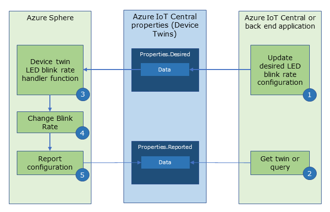
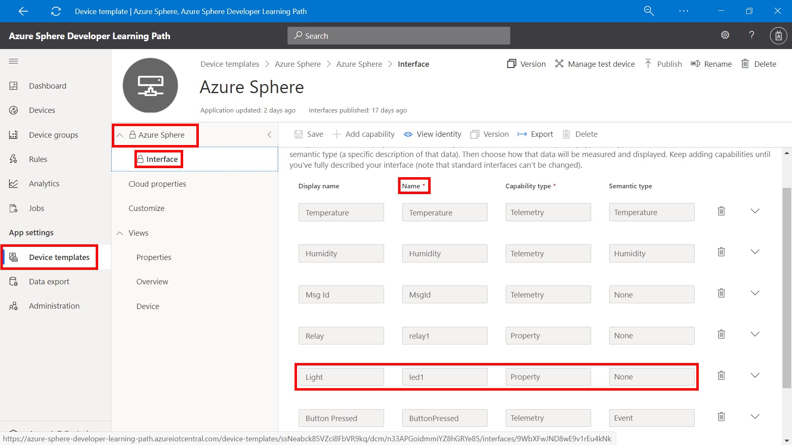
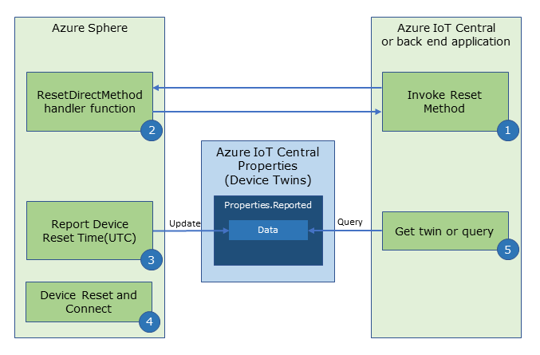
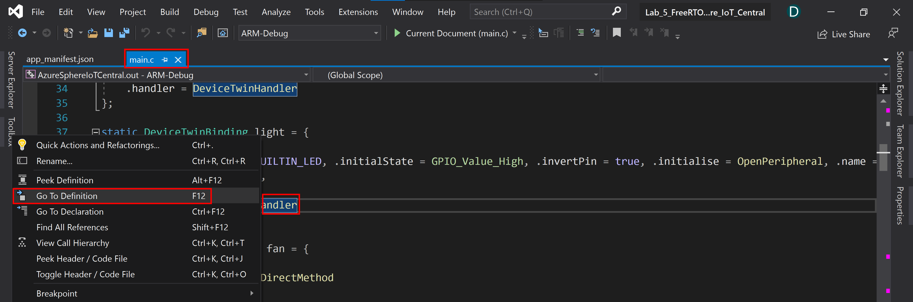
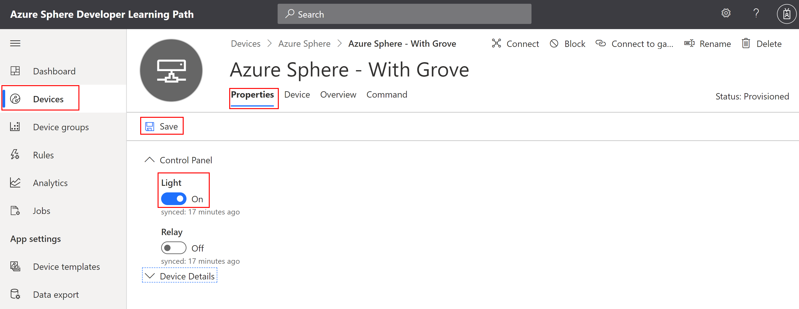
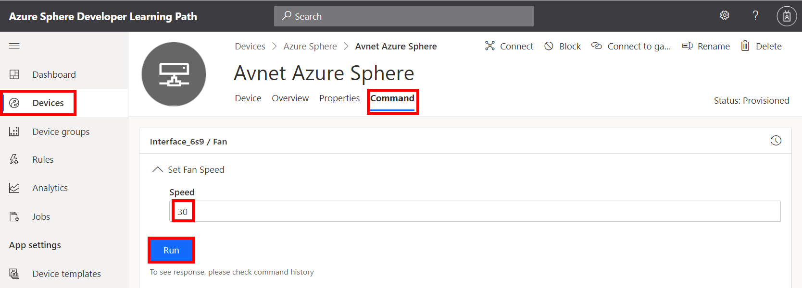
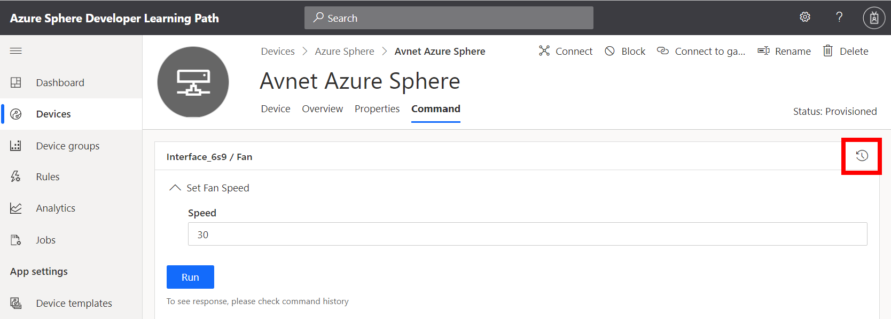
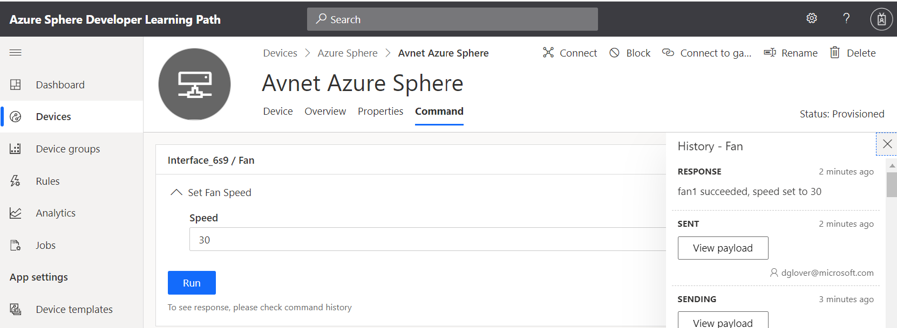

# Lab 3: Control an Azure Sphere with Device Twins and Direct Methods

---

|Author|[Dave Glover](https://developer.microsoft.com/en-us/advocates/dave-glover?WT.mc_id=github-blog-dglover), Microsoft Cloud Developer Advocate, [@dglover](https://twitter.com/dglover) |
|:----|:---|
|Source Code | https://github.com/gloveboxes/Azure-Sphere-Learning-Path.git |
|Date| March 2020|

---

## Azure Sphere Learning Path

Each module assumes you have completed the previous module.

[Home](https://github.com/gloveboxes/Azure-Sphere-Learning-Path/blob/master/README.md)

* Lab 0: [Introduction Azure Sphere and Lab Set Up](/zdocs/Lab_0_Introduction_and_Lab_Set_Up/README.md)
* Lab 1: [Build your first Azure Sphere Application with Visual Studio](/zdocs/Lab_1_Visual_Studio_and_Azure_Sphere/README.md)
* Lab 2: [Send Telemetry from an Azure Sphere to Azure IoT Central](/zdocs/Lab_2_Send_Telemetry_to_Azure_IoT_Central/README.md)
* Lab 3: [Control an Azure Sphere with Device Twins and Direct Methods](/zdocs/Lab_3_Control_Device_with_Device_Twins_and_Direct_Methods/README.md)
* Lab 4: [Integrating FreeRTOS with Azure Sphere Inter-Core Messaging](/zdocs/Lab_4_FreeRTOS_and_Inter-Core_Messaging/README.md)
* Lab 5: [Integrating FreeRTOS with Azure IoT Central](/zdocs/Lab_5_FreeRTOS_and_Azure_IoT_Central/README.md)
* Lab 6: [Mass Device Deployment with Azure IoT Central](/zdocs/Lab_6_Mass_Device_Deployment/README.md)

---

## What you will learn

You will learn how to control an [Azure Sphere](https://azure.microsoft.com/services/azure-sphere/?WT.mc_id=github-blog-dglover) application using [Azure IoT Central](https://azure.microsoft.com/services/iot-central/?WT.mc_id=github-blog-dglover) Properties ([Azure IoT Hub Device Twins](https://docs.microsoft.com/en-us/azure/iot-hub/iot-hub-devguide-device-twins?WT.mc_id=github-blog-dglover)) and Commands ([Azure IoT Hub Direct Methods](https://docs.microsoft.com/en-us/azure/iot-hub/iot-hub-devguide-direct-methods?WT.mc_id=github-blog-dglover)).

---

## Prerequisites

This lab assumes you have completed [Lab 2: Send Telemetry from an Azure Sphere to Azure IoT Central](../Lab_2_Send_Telemetry_to_Azure_IoT_Central/README.md). You will have created an Azure IoT Central application, connected Azure IoT Central to your Azure Sphere Tenant and you have configured the **app_manifest.json** for the Azure Device Provisioning Service.

You will need to **copy** and **paste** the Lab 2 **app_manifest.json** you created to this lab's **app_manifest.json** file.

---

## Tutorial Overview

There are three ways that Azure IoT cloud applications can communicate with devices. 

[Direct Methods](https://docs.microsoft.com/en-us/azure/iot-hub/iot-hub-devguide-direct-methods) for communications that require immediate confirmation of the result. Direct methods are often used for interactive control of devices such as turning on a fan.

[Device Twins](https://docs.microsoft.com/en-us/azure/iot-hub/iot-hub-devguide-device-twins) for long-running commands intended to put the device into a certain desired state. For example, set the telemetry send interval to 30 minutes.

[Cloud-to-device](https://docs.microsoft.com/en-us/azure/iot-hub/iot-hub-devguide-messages-c2d) messages for one-way notifications to the device app.

This lab will cover Azure IoT Device Twins and Direct Methods.

---

## Key Concepts

In Lab 1, **Peripherals** and **Event Timers** were introduced to simplify and effectively describe GPIO pins and Timers and their interactions.

In this lab, **DeviceTwinBindings**, and **DirectMethodBindings** are introduced to simplify the implementation of Azure IoT [Device Twins](https://docs.microsoft.com/en-us/azure/iot-hub/iot-hub-devguide-device-twins?WT.mc_id=github-blog-dglover) and Azure IoT [Direct Methods](https://docs.microsoft.com/en-us/azure/iot-hub/iot-hub-devguide-direct-methods?WT.mc_id=github-blog-dglover) on the device.

Both Device Twins and Direct Methods provide a mechanism to invoke functionality on a device from a custom Azure IoT Hub application or from an Azure IoT Central Application. For example, you may want to turn on a light, start a fan, or change the rate a sensor is sampled.

### Azure IoT Device Twins

Azure IoT Device Twins enable an application to set the *desired* state of a property on a device and have the device *report* back its new state. The advantage of Device Twins is that you can query and make decisions using the cloud side reported state of a device.

The following outlines how Azure IoT Central uses Device Twins to set properties on a device:

1. A user sets the value of a property in Azure IoT Central. For example, turn on a light, or change the blink rate of an LED.
2. Azure IoT sends a *desired* property message to the device.
3. The *desired* property is applied on the device, in this case, change the LED blink rate.
4. The device sends a *reported* property message back to Azure IoT. In this example, the new LED blink rate would be reported.
5. Azure IoT Central queries and displays the devices *reported* property data.  



For more information refer to the [Understand and use device twins in IoT Hub](https://docs.microsoft.com/en-us/azure/iot-hub/iot-hub-devguide-device-twins?WT.mc_id=github-blog-dglover) article.

### Azure IoT Direct Methods

Azure IoT Direct Methods can be used to an action on a device.  This message includes the name of the direct method and a data payload. The device will action the request and then respond with an HTTP status code to indicate the success or failure of an action, along with an optional message.

The following outlines how Azure IoT Central Commands uses Direct Methods to invoke an action on a device:

1. A user invokes an Azure IoT Central Command and an Azure IoT Direct Method message is sent to the device. For example, reset the device. This message includes the method name, and an optional payload.
2. The handler function associated with the Direct Method name is called on the device.
3. The action is invoked.
4. The device responds with an HTTP status code, and optionally a response message.


For more information refer to the [Understand and invoke direct methods from IoT Hub](https://docs.microsoft.com/en-us/azure/iot-hub/iot-hub-devguide-direct-methods?WT.mc_id=github-blog-dglover) article.

---

## Azure IoT Central and Device Twin Bindings

Azure IoT Central Properties are implemented using Azure IoT Device Twins.

* Azure IoT Central uses properties and device twins to set the desired state on a device.
* Azure IoT Central uses device twins *reported* state to display the last synced state of a property.

### Device Twin Binding for Cloud to Device updates

In main.c the variable named **led1BlinkRate** of type **DeviceTwinBinding**  is declared. This variable maps the Azure IoT Central *LedBlinkRate* property with a handler function named **DeviceTwinBlinkRateHandler**.

```c
static DeviceTwinBinding led1BlinkRate = { .twinProperty = "LedBlinkRate", .twinType = TYPE_INT, .handler = DeviceTwinBlinkRateHandler };
```

### Device Twin Bindings for Device to Cloud updates

You can also define a Device to Cloud DeviceTwinBinding. The following example binds the Device Twin property ButtonPressed. Note, there is no handler function registered as this is a one-way device to cloud binding.

```c
static DeviceTwinBinding buttonPressed = { .twinProperty = "ButtonPressed", .twinType = TYPE_STRING };
```

To update the Device Twin, call the DeviceTwinReportState function. You must pass in a property of the correct type, in this case **TYPE_STRING** (aka char*). This example can be found in the **ButtonPressCheckHandler** handler function found in **main.c**.

```c
DeviceTwinReportState(&buttonPressed, "ButtonA");   // TwinType = TYPE_STRING
```

### Opening, Dispatching, and Closing Device Twin Bindings

Device Twin Bindings can be automatically opened, dispatched, and closed if they are added to the deviceTwinDevices array. Device Twin Bindings added to the **deviceTwinBindings array** is referred to as a **set** of device twin bindings.

```c
DeviceTwinBinding* deviceTwinBindings[] = { &led1BlinkRate, &buttonPressed, &relay1DeviceTwin };
```

#### Opening

The Direct Method Bindings are initialized in the **InitPeripheralsAndHandlers** function found in **main.c**.

```c
OpenDeviceTwinSet(deviceTwinBindings, NELEMS(deviceTwinBindings));
```

#### Dispatching

When a Device Twin message is received the DeviceTwinBindings Set is checked for a matching DeviceTwinBinding *twinProperty* name. When a match is found, the corresponding DeviceTwinBinding handler function is called.

#### Closing

The Direct Method Bindings are closed in the **ClosePeripheralsAndHandlers** function found in **main.c**.

```c
CloseDeviceTwinSet();
```

---

## Mapping Device Twin Bindings to Azure IoT Central Interface Properties

1. From Azure IoT Central, navigate to **Device template**, and select the **Azure Sphere** template.
2. Click on **Interfaces** to list the interface capabilities.
3. Scroll down and expand the **LedBlinkRate** capability.
4. Review the definition of **LedBlinkRate**. The capability type is **Property**, the Schema type is **Integer**, and the property is **Writeable**. Writeable means this property is enabled for Cloud to Device updates.

	

---

## Device Twin Binding Handler Function

This is the implementation on the **DeviceTwinBlinkRateHandler**. The handler function is called when the device receives a Device Twin desired state message for the **LedBlinkRate** property from Azure IoT Central.

```c
/// <summary>
/// Set Blink Rate using Device Twin "LedBlinkRate": {"value": 0}
/// </summary>
static void DeviceTwinBlinkRateHandler(DeviceTwinBinding* deviceTwinBinding) {
	switch (deviceTwinBinding->twinType) {
	case TYPE_INT:
		Log_Debug("\nInteger Value '%d'\n", *(int*)deviceTwinBinding->twinState);

		Led1BlinkIntervalIndex = *(int*)deviceTwinBinding->twinState % led1BlinkIntervalsCount;
		ChangeTimer(&led1BlinkTimer, &led1BlinkIntervals[Led1BlinkIntervalIndex]);

		break;
	case TYPE_BOOL:
		Log_Debug("\nBoolean Value '%d'\n", *(bool*)deviceTwinBinding->twinState);
		// Your implementation goes here - for example turn in light
	case TYPE_FLOAT:
		Log_Debug("\nFloat Value '%f'\n", *(float*)deviceTwinBinding->twinState);
		// Your implementation goes here - for example set a threshold
		break;
	case TYPE_STRING:
		Log_Debug("\nString Value '%s'\n", (char*)deviceTwinBinding->twinState);
		// Your implementation goes here - for example update display
		break;
	default:
		break;
	}
}
```

---

## Direct Method Bindings

Azure IoT Central uses Commands to control devices. Commands are implemented in Azure Iot Central using Azure IoT Direct Methods. Direct methods represent a request-reply interaction with a device similar to an HTTP call in that they succeed or fail immediately (after a user-specified timeout).


### Declaring a Direct Method Binding

Direct Method Bindings associate Azure IoT Direct Methods with a handler function. In the following example, when the device receives an Azure IoT Direct Method named **ResetMethod**, the **ResetDirectMethod** handler function will be called.


```c
static DirectMethodBinding resetDevice = { .methodName = "ResetMethod", .handler = ResetDirectMethod };
```

### Opening, Dispatching, and Closing Direct Method Bindings

Like Peripherals, Timers, and Device Twin Bindings, Direct Method Bindings can be automatically opened, dispatched, and closed if they are added to the directMethodBindings array. Direct Method Bindings added to the **directMethodBindings array** are referred to as a **set** of direct method bindings.

```c
DirectMethodBinding* directMethodBindings[] = { &resetDevice };
```

#### Opening

The Direct Method Bindings are initialized in the **InitPeripheralsAndHandlers** function found in **main.c**.

```c
OpenDirectMethodSet(directMethodBindings, NELEMS(directMethodBindings));
```

#### Dispatching

When a Direct Method message is received the DirectMethodTwinBindings Set is checked for a matching DirectMethodBinding *methodName* name. When a match is found, the DirectMethodBinding handler function is called.

#### Closing

The Direct Method Bindings are closed in the **ClosePeripheralsAndHandlers** function found in **main.c**.

```c
CloseDirectMethodSet();
```

---

## Direct Method Handler Function

The **ResetDirectMethod** handler function found in **main.c** implements the DirectMethodBinding. The function is passed a JSON object *{"reset_timer":5}*, this is deserialized, range checked, a One-Shot Timer is set to do the device reset. This leaves enough time for the application to respond to Azure IoT Central with a response message and an HTTP status code before resetting.



```c
/// <summary>
/// Start Device Power Restart Direct Method 'ResetMethod' {"reset_timer":5}
/// </summary>
static DirectMethodResponseCode ResetDirectMethod(JSON_Object* json, DirectMethodBinding* directMethodBinding, char** responseMsg) {
	const char propertyName[] = "reset_timer";
	const size_t responseLen = 60; // Allocate and initialize a response message buffer. The calling function is responsible for the freeing memory
	static struct timespec period;

	*responseMsg = (char*)malloc(responseLen);
	memset(*responseMsg, 0, responseLen);

	if (!json_object_has_value_of_type(json, propertyName, JSONNumber)) {
		return METHOD_FAILED;
	}
	int seconds = (int)json_object_get_number(json, propertyName);

	if (seconds > 0 && seconds < 10) {

		// Report Device Reset UTC
		DeviceTwinReportState(&deviceResetUtc, GetCurrentUtc(msgBuffer, sizeof(msgBuffer)));			// TYPE_STRING

		// Create Direct Method Response
		snprintf(*responseMsg, responseLen, "%s called. Reset in %d seconds", directMethodBinding->methodName, seconds);

		// Set One Shot Timer
		period = (struct timespec){ .tv_sec = seconds, .tv_nsec = 0 };
		SetOneShotTimer(&resetDeviceOneShotTimer, &period);

		return METHOD_SUCCEEDED;
	}
	else {
		snprintf(*responseMsg, responseLen, "%s called. Reset Failed. Seconds out of range: %d", directMethodBinding->methodName, seconds);
		return METHOD_FAILED;
	}
}
```

### Mapping Azure IoT Central Interface Command with Direct Method Bindings

Azure IoT Central application template interface includes a command capability. The command capability defines a display name, a command named **ResetMethod**, and schema information. The command name maps to the DirectMethodBinding **methodName**.

From your web browser, switch back to the Azure IoT Central application and explore the Azure Sphere Device Template and the Interfaces.


#### ResetMethod Object Schema

The **ResetMethod** schema is of type **Object**. Clicking on the **view** button will display the object definition. The Object definition describes the shape of the JSON payload sent when the Direct Method is invoked.

The **ResetMethod** handler function is expecting a JSON payload like this {"reset_timer":5}.


---

## Open Lab 3

### Step 1: Start Visual Studio 2019


### Step 2: Open the lab project

1. Click **Open a local folder**
2. Open the Azure-Sphere lab folder
3. Open the **folder name** that corresponds to the **Azure Sphere board** you are using
4. Open the **Lab_3_Cloud_to_Device_Control_Twins_Methods** folder
5. Click **Select Folder** button to open the project

    <!--  -->

### Step 3: Configure the Azure IoT Central Connection Information

1. Open the **app_manifest.json** file
2. You will need to redo the settings for the **app_manifest.json** file. Either copy from **Notepad** if you still have open or copy from the **app_manifest.json** file you created in lab 2.

    

3. Update the contents of this **app_manifest.json**.

---

## Support for Azure IoT Central Properties

1. Open the **main.c** file
2. Navigate to the declaration of **static DeviceTwinBinding led1BlinkRate**. 

    * If you have Visual Studio line numbers then scroll down to around line 90. 
    * You can also use **find**, press <kbd>Ctrl+f</kbd>, and type *led1BlinkRate*.

    ```c
    static DeviceTwinBinding led1BlinkRate = { .twinProperty = "LedBlinkRate", .twinType = TYPE_INT, .handler = DeviceTwinBlinkRateHandler };
    ```

    This data structure describes the Device Twin. Defined is the Azure IoT Central Device Twin **Property**, the data type, and the **handler** function named **DeviceTwinBlinkRateHandler**.

3. Right mouse click on **DeviceTwinBlinkRateHandler**, and select **Go To Definition**.
    
4. This will jump you to the function named **DeviceTwinBlinkRateHandler**. Review the implementation of the handler.

### Support for Azure IoT Central Commands

1. Again, in the **main.c** file
2. Navigate to the line that reads **static DirectMethodBinding resetDevice**.
    * If you have Visual Studio line numbers then scroll down to around line 95. 
    * You can also use **find**, press <kbd>Ctrl+f</kbd>, and type *resetDevice*.

    ```c
    static DirectMethodBinding resetDevice = { .methodName = "ResetMethod", .handler = ResetDirectMethod };
    ```

4. Again, right mouse click the **ResetDirectMethod** handler and select **Go To Definition**, and review the handler implementation.

### Support for IoT Central Properties and Commands

1. From **main.c**.
2. Press <kbd>Ctrl+f</kbd>, and search for **deviceTwinBindings**. In this code section, the **deviceTwinBindings** and **directMethodBindings** sets are declared.

    ```c
	DeviceTwinBinding* deviceTwinBindings[] = { &led1BlinkRate, &buttonPressed, &relay1DeviceTwin, &deviceResetUtc };
	DirectMethodBinding* directMethodBindings[] = { &resetDevice };
    ```

3. From main.c, navigate to the **InitPeripheralsAndHandlers** function. This is where the device twins and direct methods **sets** are opened.

    ```c
    /// <summary>
    ///  Initialize peripherals, device twins, direct methods, timers.
    /// </summary>
    /// <returns>0 on success, or -1 on failure</returns>
    static int InitPeripheralsAndHandlers(void) {
        InitializeDevKit();

        OpenPeripheralSet(peripherals, NELEMS(peripherals));
        OpenDeviceTwinSet(deviceTwinBindings, NELEMS(deviceTwinBindings));
        OpenDirectMethodSet(directMethodBindings, NELEMS(directMethodBindings));

        StartTimerSet(timers, NELEMS(timers));

        return 0;
    }
    ```

---

## Visual Studio Deployment Settings

Before building the application with Visual Studio ensure ARM-Debug and GDB Debugger (HLCore) options are selected.


---

## Build, Deploy and start Debugging

To start the build, deploy and debug process, either click the Visual Studio **Start Selected Item** icon or press <kbd>**F5**</kbd>. To Build and deploy without attaching the debugger, press <kbd>**Ctrl+F5**</kbd>.


---

## Expected Device Behaviour

### Avnet Azure Sphere MT3620 Starter Kit


1. The blue LED will start to blink
2. Press **Button A** on the device to change the blink rate and generate **Button Pressed Events**.
3. Press **Button B** on the device to generate **Button Pressed Events**.

### Seeed Studio Azure Sphere MT3620 Development Kit


1. The blue LED will start to blink
2. Press **Button A** on the device to change the blink rate and generate **Button Pressed Events**.
3. Press **Button B** on the device to generate **Button Pressed Events**.

### Seeed Studio MT3620 Mini Dev Board


1. The green LED closest to the USB connector will start to blink
2. Given no builtin buttons, virtual **Button A** and **Button B** presses will be generated every 5 seconds. The blink rate will change and **Button Pressed Events** will be generated.

---

## Viewing the Device Telemetry in Azure IoT Central

1. Switch to Azure IoT Central in your browser.
2. Select the **Devices**, then the **Azure Sphere** template, then your device.
3. Select the **Telemetry** tab.

Azure IoT Central does not update immediately. It may take a minute or two for temperature, humidity, button pressed alerts, and message count to be displayed.


## Testing Azure IoT Central Property Updates

Select the **Properties** tab, update the **Led Blink Rate [0..4]** field, then click **Save**.



### Expected Behaviour

The expected behaviour will differ depending on what Azure Sphere device you have.

* **Azure Sphere MT3620 Starter Kit**: See that an **Orange** LED blink rate will change depending on the blink rate you set and saved.
* **Seeed Studio Azure Sphere MT3620 Development Kit**: See that a **Red** LED blink rate will change depending on the blink rate you set and saved.
* **Seeed Studio Azure Sphere MT3620 Mini Dev Board**: See that a **Green** LED blink rate will change depending on the blink rate you set and saved.

---

## Testing Azure IoT Central Commands

1. From Visual Studio, ensure the Azure Sphere is running the application and set a breakpoint in the **ResetDirectMethod** handler function.
2. Switch to Azure IoT Central in your web browser.
3. Select the Azure IoT Central **Commands** tab.
4. Set the **Reset Azure Sphere** time in seconds, then click **Run**.
5. Observer the device rebooting. The LEDs will stop blinking for a few seconds.
    
6. Switch back to Visual Studio, the application should have stopped where you set the breakpoint. Step over code <kbd>F10</kbd>, step into code <kbd>F11</kbd>, and continue code execution <kbd>F5</kbd>.
7. Switch back to Azure IoT Central, and click the **View History** button.
    
8. The command history will be similar to the following:

	> Note, you may see a timed out message in the history depending on how long it took you to step through the code in Visual Studio.

    

---

## Viewing Reported Status

The **Status** tab displays the latest reported data from the Azure Sphere device.


---

## Close Visual Studio

Now close **Close Visual Studio**.

---

## Finished 完了 fertig finito ख़त्म होना terminado

Congratulations you have finished lab 3.


---

**[NEXT](../Lab_4_FreeRTOS_and_Inter-Core_Messaging/README.md)**

---
