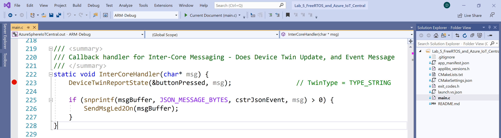

# Lab 5: Integrating FreeRTOS with Azure IoT Central

<!--  -->

---

|Author|[Dave Glover](https://developer.microsoft.com/en-us/advocates/dave-glover?WT.mc_id=github-blog-dglover), Microsoft Cloud Developer Advocate, [@dglover](https://twitter.com/dglover) |
|:----|:---|
|Source Code | https://github.com/gloveboxes/Azure-Sphere-Learning-Path.git |
|Date| March 2020|

---

## Azure Sphere Learning Path

Each module assumes you have completed the previous module.

[Home](https://github.com/gloveboxes/Azure-Sphere-Learning-Path/blob/master/README.md)

* Lab 0: [Introduction Azure Sphere and Lab Set Up](/zdocs/Lab_0_Introduction_and_Lab_Set_Up/README.md)
* Lab 1: [Build your first Azure Sphere Application with Visual Studio](/zdocs/Lab_1_Visual_Studio_and_Azure_Sphere/README.md)
* Lab 2: [Send Telemetry from an Azure Sphere to Azure IoT Central](/zdocs/Lab_2_Send_Telemetry_to_Azure_IoT_Central/README.md)
* Lab 3: [Control an Azure Sphere with Device Twins and Direct Methods](/zdocs/Lab_3_Control_Device_with_Device_Twins_and_Direct_Methods/README.md)
* Lab 4: [Integrating FreeRTOS with Azure Sphere Inter-Core Messaging](/zdocs/Lab_4_FreeRTOS_and_Inter-Core_Messaging/README.md)
* Lab 5: [Integrating FreeRTOS with Azure IoT Central](/zdocs/Lab_5_FreeRTOS_and_Azure_IoT_Central/README.md)
* Lab 6: [Over-the-air (OTA) Deployment](/zdocs/Lab_6_Over-the-air-deployment/README.md)

---

## Prerequisites

This lab assumes you have completed [Lab 2: Send Telemetry from an Azure Sphere to Azure IoT Central](../Lab_2_Send_Telemetry_to_Azure_IoT_Central/README.md). You will have created an Azure IoT Central application, connected Azure IoT Central to your Azure Sphere Tenant, and you have configured the **app_manifest.json** for the Azure Device Provisioning Service.

You will need to **copy** and **paste** the Lab 2 **app_manifest.json** you created and copied to Notepad to this lab's **app_manifest.json** file.

---

## What you will learn

You will learn how Azure Sphere **Inter-Core** messaging works.

---

## Prerequisites

1. You have completed Lab 4, and the FreeRTOS real-Time application is running the Azure Sphere device.
2. You have completed [Lab 2: Send Telemetry from an Azure Sphere to Azure IoT Central](../Lab_2_Send_Telemetry_to_Azure_IoT_Central/README.md). You will need to **copy** and **paste** the Lab 2 **app_manifest.json** you saved to Notepad to this lab's **app_manifest.json** file.

---

## Tutorial Overview

1. Deploy an **Inter-Core** messaging enabled High-Level application to the Azure Sphere.

---

## Key Concepts

As a reminder, the Azure Sphere has three application cores. The Cortex A7 runs High-Level applications, the two Cortex M4s run Real-Time applications.

In this lab, we are going to deploy a High-Level application that will accept event messages from the FreeRTOS Real-Time application and then will forward them on to Azure IoT Central.


---

## Open Lab 5

### Step 1: Start Visual Studio 2019


### Step 2: Open the lab project

1. Click **Open a local folder**
2. Open the Azure-Sphere lab folder
3. Open the **folder name** that corresponds to the **Azure Sphere board** you are using
4. Open the **Lab_5_FreeRTOS_and_Azure_IoT_Central** folder
5. Click **Select Folder** button to open the project

### Step 3: Review the App Manifest

1. Open the **app_manifest.json** file.
2. Review the contents and note the **AllowedApplicationConnections** property setting that is populated with the Component ID of the FreeRTOS Real-Time application.

```json
{
  "SchemaVersion": 1,
  "Name": "AzureSphereIoTCentral",
  "ComponentId": "25025d2c-66da-4448-bae1-ac26fcdd3627",
  "EntryPoint": "/bin/app",
  "CmdArgs": [ "<Replace with your ID Scope>", "6583cf17-d321-4d72-8283-0b7c5b56442b" ],
  "Capabilities": {
    "Gpio": [
      "$LED2",
      "$NETWORK_CONNECTED_LED",
      "$RELAY"
    ],
    "I2cMaster": [ "$AVNET_MT3620_SK_ISU2_I2C" ],
    "Adc": [ "$AVNET_MT3620_SK_ADC_CONTROLLER0" ],
    "PowerControls": [ "ForceReboot" ],
    "AllowedConnections": [ "global.azure-devices-provisioning.net", "<Replace with your Azure IoT Central URI>" ],
    "DeviceAuthentication": "<Replace with your Azure Sphere Tenant ID>",
    "AllowedApplicationConnections": [ "6583cf17-d321-4d72-8283-0b7c5b56442b" ]
  },
  "ApplicationType": "Default"
}
```

---

## Step 4: Set Azure IoT Central Connection Information

1. Open the **app_manifest.json** file.
2. **DO NOT** replace the contents of the **app_manifest.json** file as you did in previous labs. The GPIO pin allocation is different as pins have been allocated to the FreeRTOS Real-Time application.
3. Using the information you saved to **Notepad** property.
4. Update the **Scope ID** property.
5. Update the **Azure IoT Central URL** property.
6. Update the **DeviceAuthentication** property.

---

## Step 5: Set a Breakpoint in the InterCoreHandler Function

1. Open **main.c**
2. From the **Navigate Functions dropdown**, select the second of the two **InterCoreHandler** items listed.
    
3. Set a debugger breakpoint in near the beginning of the function.
    

---

## Visual Studio Deployment Settings

Before building the application with Visual Studio, ensure ARM-Debug and GDB Debugger (HLCore) options are selected.


---

## Build, Deploy and start Debugging

1. To start the build, deploy, and debug process, either click the Visual Studio **Start Selected Item** icon or press <kbd>**F5**</kbd>.

    

## Expected Behaviour

1. Generate a **Button Pressed** event from the FreeRTOS application running on the Real-Time core.

    * For Azure Sphere devices with the built-in buttons, press **Button A** to generate a **ButtonPressed** event.
    * For the Seeed Studio MT3620 Mini Dev Board, a **ButtonPressed** event is automatically generated every 10 seconds.

2. Visual Studio will halt execute in the **InterCoreHandler** at the breakpoint.
3. You can now step through the code by pressing <kbd>**F10**</kbd> to step over, <kbd>**F11**</kbd> to step into, or <kbd>**F5**</kbd> to continue.
4. Delete all Breakpoints. From the Visual Studio main menu, select **Debug**, then **Delete All Breakpoints**.
    
5. Press <kbd>**F5**</kbd> to continue application execution.

---

## Close Visual Studio

1. Close both instances of Visual Studio

---

## Finished 完了 fertig finito समाप्त terminado

Congratulations you have finished lab 5.


<!-- ---  -->

<!-- **[NEXT](../Lab_6_Mass_Device_Deployment/README.md)** -->

---
